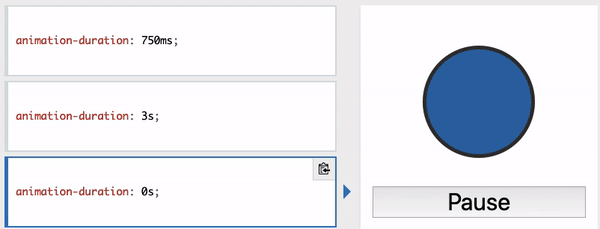
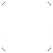
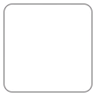
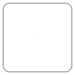
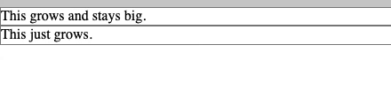

# Overview

[animation](#-animation) <br>
[keyframes](#-keyframes) <br>
[animation-name](#-animation-name) <br>
[animation-duration](#-animation-duration) <br>
[animation-delay](#-animation-delay) <br>
[animation-duration](#-animation-duration) <br>
[animation-iteration-count](#-animation-iteration-count) <br>

CSS animations make it possible to animate transitions from one CSS style configuration to another. Animations consist of two components, a style describing the CSS animation and a set of keyframes that indicate the start and end states of the animation's style, as well as possible intermediate waypoints.

## //////////////////////////////////////////////////////////// `animation`

Applies an animation between styles. It is a shorthand property for :

- `animation-direction`
- `animation-duration`
- `animation-delay`
- `animation-fill-mode`
- `animation-iteration-count`
- `animation-name`
- `animation-play-state`
- `animation-timing-function`

[To Top](#overview)

## //////////////////////////////////////////////////////////// @keyframes

Specifies the animation code. The animation is created by gradually changing from one set of CSS styles to another. During the animation, you can change the set of CSS styles many times.

Specify when the style change will happen in %, or with the keywords "from" and "to", which is the same as 0% and 100%.

**Tip:** For best browser support, you should always define both the 0% and the 100% selectors.

## Property Values:

<ins>**_animationname_**</ins>

Required. Defines the name of the animation.

<ins>**_keyframes-selector_**</ins>

Required. % of the animation duration.

Legal values:

- 0-100%
- from (same as 0%)
- to (same as 100%)

[To Top](#overview)

## //////////////////////////////////////////////////////////// `animation-name`

Specifies a name for the @keyframes animation rule.

## Property Values:

<ins>**_keyframename_**</ins>

Specifies the name of the keyframe you want to bind to the selector.

<ins>**none**</ins>

Default value. Specifies that there will be no animation.

[To Top](#overview)

## //////////////////////////////////////////////////////////// `animation-duration`

Defines how long an animation should take to complete one cycle.

## Property Values:

<ins>**time**</ins>

Specifies the length of time an animation should take to complete one cycle. Default value is 0, which means that no animation will occur.



[To Top](#overview)

## //////////////////////////////////////////////////////////// `animation-delay`

Specifies a delay for the start of an animation. This property is defined in seconds (s) od milliseconds (ms).

## Property Values:

<ins>**time**</ins>

Optional. Defines the number of seconds (s) or milliseconds (ms) to wait before the animation will start. Default value is 0. Negative values are allowed.

This example shows rotation delay for 2 seconds.

## Example Code:

<br>

> **HTML**

```
<main>
    <div class="box box1"></div>
</main>
```

> **CSS**

```
main {
  height: 50vh;
  display: flex;
}

.box {
  margin: auto;
  border-radius: 10px;
  width: 100px;
  height: 100px;
  animation-name: rotate;
  animation-duration: 1.7s;
  animation-delay: 2s;
}

@keyframes rotate {
  0% {
    transform: rotate(0);
  }
  100% {
    transform: rotate(360deg);
  }
}
```


[To Top](#overview)

## //////////////////////////////////////////////////////////// `animation-direction`

Defines whether an animation should be played forwards, backwards or in alternate cycles.

## Property Values:

<ins>**normal**</ins>

Default value. The animation is played as normal (forwards).



<ins>**reverse**</ins>

The animation is played in reverse direction (backwards).



<ins>**alternate**</ins>

The animation is played forwards first, then backwards. In order to start animation in reverse order the `animation-iteration-count` should be mentioned. The count to determine if a cycle is even or odd starts at one.



<ins>**alternate-reverse**</ins>

The animation is played backwards first, then forwards. For multiple cycles use property `animation-iteration-count`.

## Example Code:

<br>

> **HTML**

```
<main>
    <div class="box box1"></div>
</main>
```

> **CSS**

```
main {
  height: 50vh;
  display: flex;
}

.box {
  margin: auto;
  border-radius: 10px;
  width: 100px;
  height: 100px;
  animation-name: rotate;
  animation-duration: 1.7s;
  animation-iteration-count: 3;
  animation-direction: alternate;
}

@keyframes rotate {
  0% {
    transform: rotate(0);
    background-color: rebeccapurple;
  }
  100% {
    transform: rotate(360deg);
    background-color: red;
  }
}
```

[To Top](#overview)

## //////////////////////////////////////////////////////////// `animation-iteration-count`

Sets the number of times an animation sequence should be played before stopping.

## Property Values:

<ins>**_number_**</ins>

A number that defines how many times an animation should be played. Default value is 1.

<ins>**infinite**</ins>

Specifies that the animation should be played infinite times (for ever).

[To Top](#overview)

## //////////////////////////////////////////////////////////// `animation-fill-mode`

Sets how a CSS animation applies styles to its target before and after its execution.

## Property Values:

<ins>**none**</ins>

Default value. Animation will not apply any styles to the element before or after it es executing.

<ins>**forwards**</ins>

The element will retain the style values that is set by the last keyframe (depends on animation-direction and animation-iteration-count).

<ins>**backwards**</ins>

The element will get the style values that is set by the first keyframe (depends on animation-direction), and retain this during the animation-delay period.

<ins>**both**</ins>

The animation will follow the rules for both forwards and backwards, extending the animation properties in both directions.

In this example you can see the effect of `animation-fill-mode` property. It demonstrates how, for an animation that runs for an infinite time, you can cause it to remain in its final state rather than reverting to the original state (which is the default). Also the `backwards` value takes effect whenever `animation-delay` property is mentioned.

## Example Code:

> **HTML**

```
<p>Move your mouse over the gray box!</p>
<div class="demo">
  <div class="growsandstays">This grows and stays big.</div>
  <div class="grows">This just grows.</div>
</div>
```

> **CSS**

```
.demo {
  border-top: 100px solid #ccc;
  height: 300px;
}

@keyframes grow {
  0% {
    font-size: 0;
  }
  100% {
    font-size: 40px;
  }
}

.demo:hover .grows {
  animation-name: grow;
  animation-duration: 3s;
  animation-delay: 3s;
  animation-fill-mode: backwards;
}

.demo:hover .growsandstays {
  animation-name: grow;
  animation-duration: 3s;
  animation-fill-mode: forwards;
}
```



[To Top](#overview)
