# Background

[background-attachment](#-background-attachment)  
[background-blend-mode](#-background-blend-mode)  
[background-clip](#-background-clip)  
[background-color](#-background-color)  
[background-image](#-background-image)  
[background-origin](#-background-origin)  
[background-position](#-background-position)  
[background-size](#-background-size)  

Sets all background style properties at one, such as color, image, origin and size, or repeat method.

## //////////////////////////////////////////////////////////// background-attachment

Sets whether a background image scrolls with the rest of the page, or is fixed. It’s important to distinguish between the whole page and its element with scrolling contents.

## Property Values:

<ins>**fixed**</ins>

The background is fixed relative to the viewport. Even if an element has a scrolling mechanism, the background doesn’t move with the element.

**Alt:** The background doesn’t scroll with either its element or the viewport.

<ins>**scroll**</ins>

The background is fixed relative to the element itself and does not scroll with its contents.

**Alt:** The background doesn’t scroll with the element it’s applied to but does scroll with the viewport.

<ins>**local**</ins>

The background will scroll with the element’s contents.

**Alt:** The background scrolls with both its element and the viewport.

## Example Files:

[bunny.html](html/bunny.html)  

Original [link](http://thebookofcss3.com/examples/css3_08-a.html) from the No-Starch book.

[To Top](#background)

## //////////////////////////////////////////////////////////// background-blend-mode

Defines how an element’s background-image should blend with its _background-color_:

**Alt:**

This property works solely in the context of the element: Only the background layers are blended; the element itself doesn’t blend with any part of the page below it. The property requires as a value the keyword if the blend mode you want to use, such as screen, multiply, or overlay.

The default value of _background-blend-mode_ is normal, which leaves the background layer unblended.

## Property Values:

<ins>**normal**</ins>

Default. The _background-color_ will not bleed through the background-image.

As a reference we will use image from aforementioned example:

Notice that the text color has not been affected by the additional property.

<ins>**multiply**</ins>

The _background-image_ and _background-color_ are multiplied and typically this leads to a darker image than before.

<ins>**screen**</ins>

Both image and color is inverted, multiplied and then inverted again.

**Image color inversion** describes a process where light areas become dark and vice versa. The color inversion is described as :

    •	red -> cyan
    •	green -> magenta
    •	blue -> yellow

<ins>**overlay**</ins>

The _background-color_ is mixed with the _background-image_ to reflect the lightness or darkness of the backdrop.

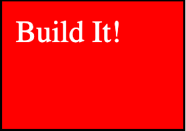

<ins>**darken**</ins>

If the _background-image_ is darker than the _background-color_ then the image is replaced, otherwise it is left as it was.

<ins>**lighten**</ins>

If the _background-image_ is lighter than the _background-color_ then the image is replaced, otherwise it is left as it was.

<ins>**color-dodge**</ins>

The _background-color_ is divided by the inverse of the background-image. This is very similar to the screen blend mode.

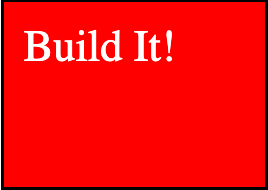

Look up the rest of property values [here](https://css-tricks.com/almanac/properties/b/background-blend-mode/).

## Example Files:

[text.html, 4th part](html/text.html)

[To Top](#background)

## //////////////////////////////////////////////////////////// background-clip

Defines how far the background (color or image) should extend within an element.

## Property Values:

<ins>**border-box:**</ins>

Default value. The background extends behind the border.

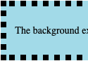

<ins>**padding-box:**</ins>

Displays the background only up to, and not behind, the border.

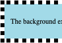

<ins>**content-box:**</ins>

The background stops at the element’s padding.

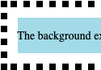

## Example Files:

[txtborder.html, 2nd part](html/txtborder.html)

[To Top](#background)

## //////////////////////////////////////////////////////////// background-color

Sets the background color of an element. The background of an element, including padding and border (but not the margin).

**Tip:** Use a background color and a text color that makes the text easy to read.

In example above the RGB (Red, Green, Blue) color model is used. Each parameter (red, green, and blue) defines the intensity of the color as an integer between 0 and 255.  
For example, rgb(0, 0, 255) is rendered as blue, because the blue parameter is set to its highest value (255) and the others are set to 0.

There is also another color model called RGBA (Red, Green, Blue, Alpha). The value of the alpha argument is the same as the value provided for opacity: a decimal fraction from 0.0 to 1.0, which is once again a measure between full transparency (0.0) and full opacity (1.0).

## Property Values:

<ins>**color:**</ins>

Specifies the background-color.

<ins>**transparent:**</ins>

Specifies that the background color should be transparent. This is default.

## Example Files:

[txtborder.html, 1st part;](html/txtborder.html)

[To Top](#background)

## //////////////////////////////////////////////////////////// background-image

Sets one or more background images for an element. By default, a background-image is placed at the top-left corner of an element, and repeated both vertically and horizontally.

## Property Values:

<ins>**url(‘URL’):**</ins>

The URL to the image. To specify more than one image, separate the URLs with a comma.

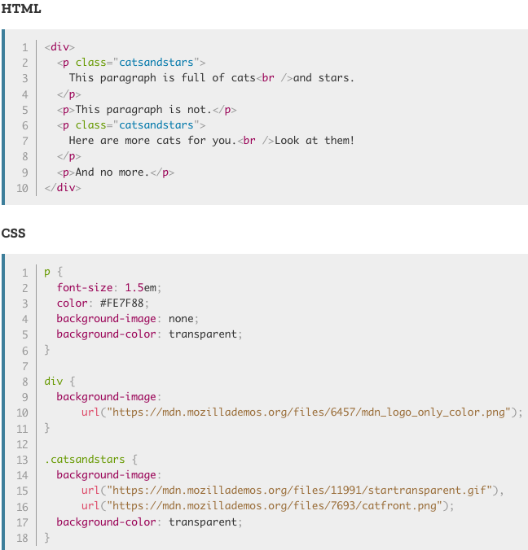

<ins>**none:**</ins>

No background image will be displayed. This is default.

[txtborder.html, 6th part](html/txtborder.html)

[To Top](#background)

## //////////////////////////////////////////////////////////// background-origin

Specifies the origin position (the background positioning area) of a background image. The property accepts the same keywords as you’ve seen in background-clip.

## Property Values:

<ins>**border-box:**</ins>

The background image starts from the upper left corner of the border

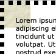

<ins>**content-box:**</ins>

The background image starts from the upper left corner of the content.

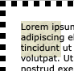

<ins>**padding-box:**</ins>

Default value. The background image starts from the upper left corner of the padding edge.

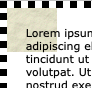

## Example Files:

[lgd.html, 4th part](html/lgd.html)

[To Top](#background)

## //////////////////////////////////////////////////////////// background-position

Sets the starting position of a background image.

**Tip:** By default, a background-image is placed at the top-left corner of an element, and repeated both vertically and horizontally.

## Property Values:

<ins>**(left) top, center, bottom:**</ins>

Following example positions the background-image at top-left corner.

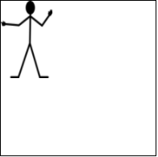

Following example centers the background-image on the right side.

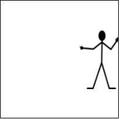

(center) top, center, bottom:

This examples centers the image at the bottom.

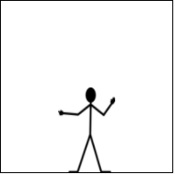

<ins>**x% y%**</ins>

The first value is the horizontal position and the second value is the vertical. The top left corner is 0% 0%. The right bottom corner is 100% 100%. If you only specify one value, the other value will be 50%.

Default value is 0% 0%.

In example below the background-image is positioned at 0% horizontally and 50% vertically.

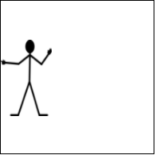

<ins>**xpos ypos%**</ins>

The first value is the horizontal position and the second value is the vertical. The top left corner is 0 0. Units can be pixels (0px 0px) or any other CSS units. If you inly specify one value, the other value will be 50%. You can mix % and positions.

## Example Files:

[txtborder.html, 6th part](html/txtborder.html)

[To Top](#background)

## //////////////////////////////////////////////////////////// background-repeat

Sets if/how a background image will be repeated. By default, a _background-image_ is repeated both vertically and horizontally.

## Property Values:

<ins>**repeat:**</ins>

The background image is repeated both vertically and horizontally. The last image will be clipped if it doesn't fit. This is default.

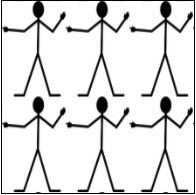

<ins>**repeat-x & repeat-y**</ins>

The background image is repeated either horizontally or vertically or both.

This example repeats background image in x-direction.

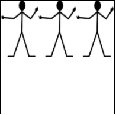

This example repeats background image in y-direction.

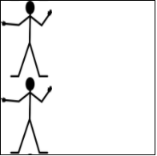

no-repeat:

The background-image is not repeated. The image will only be shown once.

Same as in left, top example.

<ins>**space:**</ins>

The background-image is repeated as much as possible without clipping. The first and last images are pinned to either side of the element, and whitespace is distributed evenly between the images.

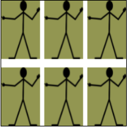

<ins>**round:**</ins>

The _background-image_ is repeated and squished or stretched to fill the space (no gaps).

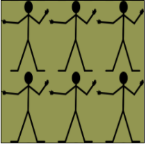

## Example Files:

[txtborder.html, 6th part](html/txtborder.html)

[To Top](#background)

## //////////////////////////////////////////////////////////// background-size

Specifies the size of the background images.

Example: txtborder.html, 6th part; brdcolor.css, 6th part

Property Values:

<ins>**auto:**</ins>

Default value. The background image is displayed in its original size.

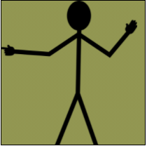

<ins>**length:**</ins>

Sets the width and height of the background image. The 1st value sets the width, the second value sets the height. If only one value is given, the second is set to “auto”.

The background-image has a background-size of 10vh & 15vh:

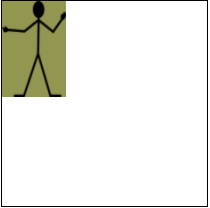

<ins>**percentage:**</ins>

Sets the width and height of the background image in percent of the parent element. Same as with length-attribute.

<ins>**cover:**</ins>

Resize the background image to cover the entire container, even if it has to stretch the image or cut a little bit off one of the edges.

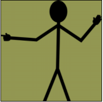

contain:

Resize the background image to make sure the image is fully visible.

## Example Files:

[txtborder.html, 6th part](html/txtborder.html)

[To Top](#background)

