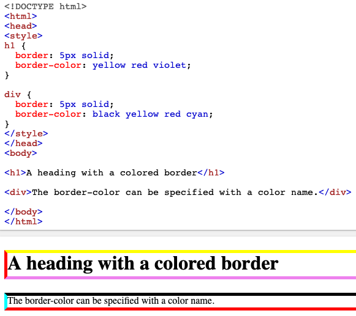
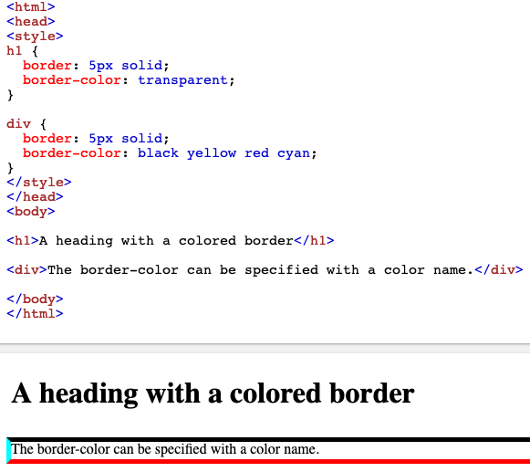

# Border

[border-color](#-border-color)

Sets an element's border.

## //////////////////////////////////////////////////////////// border-color

Sets the color of an element's four borders. This property can have one to four values.

The `border-color` property may be specified using one, two, three, or four values.

- When **one** value is specified, it applies the same color to **all four sides**.

- When **two** values are specified, the first color applies to the **top and bottom**, the second to the **left and right**.

- When **three** values are specified, the first color applies to the **top**, the second to the **left and right**, the third to the **bottom**.

- When **four** values are specified, the colors apply to the **top, right, bottom,** and **left** in that order (clockwise).

## Property Values:

<ins>**color**</ins>

Defines the color of the border.

<ins>**transparent**</ins>

Specifies that the border color should be transparent.

