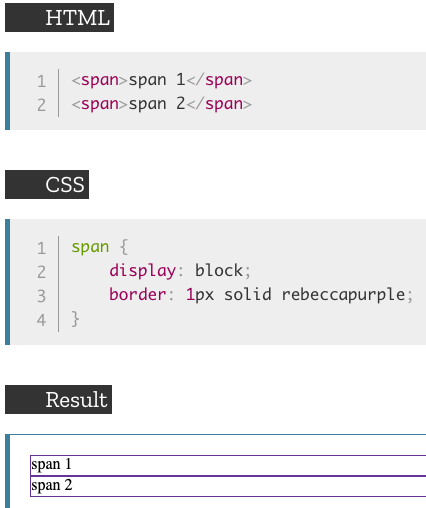
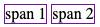
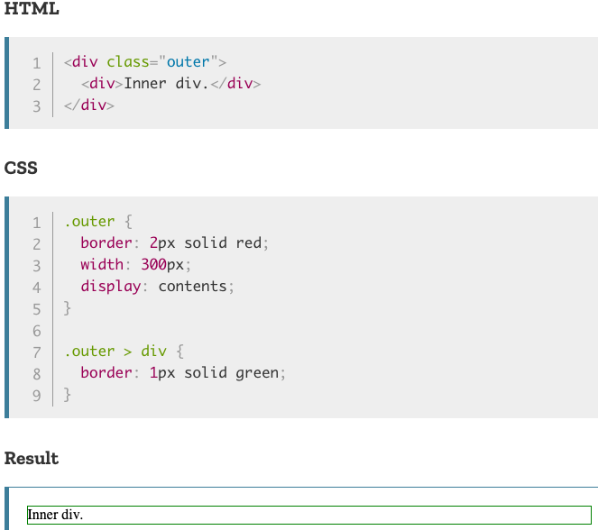
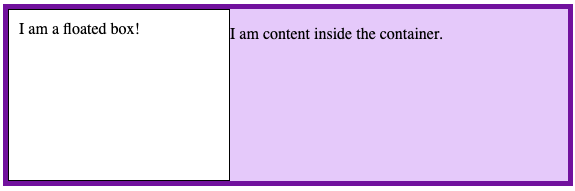
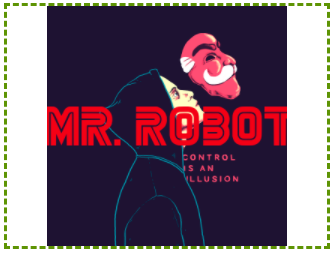

# Overview

proceed with inline block

[display](#-display)  
[object-fit](#-object-fit)  
[object-position](#-object-position)  

## //////////////////////////////////////////////////////////// display

The display property specifies if/how an element is displayed. It sets whether an element is treated as a <ins>block or inline element</ins> and the layout used for its children, such as flow layout, grid or flex.

# Property Values:

<ins>**block**</ins>

Displays an element as a block element (like `
`). it starts on a new line, and takes up the whole width.

## Example Files:

[links.html, 7th part](html/links.html)  

<ins>**inline**</ins>

Displays an element as an inline element (like ``). Any height and width properties will have no effect.

Example is the same as in `block` only with `inline` value.

## Example Files:

[links.html, 5th part](html/links.html)  

<ins>**inline-block**</ins>

Displays an element as an inline-level block container. The element itself is formatted as an inline element, but you can apply height and width values.

<ins>**none**</ins>

The element is completely removed.

<ins>**contents**</ins>

Makes the container disappear, making the child elements children of the element the next level up in the DOM.

Following example shows the outer `
` with a 2-pixel red border and a width of 300px. However it also has `display: contents` specified therefore this `
` will not be rendered, the border and width will no longer apply, and the child element will be displayed as if the parent had never existed.

## Example Files:

[links.html, 5th part](html/links.html)  

<ins>**flow-root**</ins>

The element generates a block element box that establishes a new block formatting context, defining where the formatting root lies.

## Example Files:

[links.html, 5th part](html/links.html)  

<ins>**table**</ins>

These elements behave like HTML `<table>` elements. It defines a block-level box.

<ins>**flex**</ins>

The elements behaves like a block element and lays out its content according to the flexbox model.

<ins>**grid**</ins>

The elements behaves like a block element and lays out its content according to the grid model.

## Example Files:

[links.html, 6th part](html/links.html)  

For other property values visit [MDN web docs.](https://developer.mozilla.org/en-US/docs/Web/CSS/display)

[To Top](#overview)

## //////////////////////////////////////////////////////////// object-fit

Is used to specify how an `` or `<video>` should be resized to fit its container.

## Property Values:

<ins>**fill**</ins>

Default. The replaced content is sized to fill the element's content box. If necessary, the object will be stretched or squished to fit.

<ins>**contain**</ins>

The replaced content is scaled to maintain its aspect ratio while fitting within the element's content box.

<ins>**cover**</ins>

The replaced content is sized to maintain its aspect ratio while filling the element's entire content box. The object will be clipped to fit.

<ins>**none**</ins>

The replaced content is not resized.

<ins>**scale-down**</ins>

The content is sized as if _none_ or _contain_ were specified, whichever would result in a smaller concrete object size.

Example is the same as the _content_ value.

## Example Files:

[links.html, 3rd part](html/links.html)  

[To Top](#overview)

## //////////////////////////////////////////////////////////// object-position

Is used together with _object-fit_ to specify how an ``or `<video>` should be positioned with x/y coordinates withing the element's box. Areas of the box which aren't covered by the replaced element's object will show the element's background.

## Property Values:

<ins>**position**</ins>

Specifies the position of the image or video inside its content box. First value controls the x-axis adn the second value controls the y-axis. Can be a string (left, center or right), or a number (in px or %). Negative values are allowed.

Following example shows the positioning of the image with its right edge flush against the right edge of the element's box (100% on x-axis) and is located 10% of the way down the height of the element's box (y-axis).

## Example Files:

[links.html, 4th part](html/links.html)  

[To Top](#overview)

