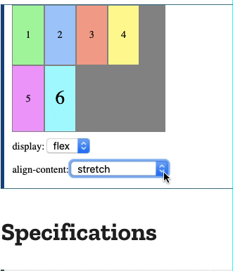

# Overview

Add 'flex' and 'order' topics

[align content](#-align-content)  
[align items](#-align-items)  
[align self](#-align-self)  
[flex ](#-flex)  
[flex basis](#-flex-basis)  
[flex direction](#-flex-direction)  
[flex flow](#-flex-flow)  
[flex grow](#-flex-grow)  
[flex shrink](#-flex-shrink)  
[flex wrap](#-flex-wrap)  
[justify content](#-justify-content)  
[justify items](#-justify-items)  
[justify self](#-justify-self)  
[order](#-order)  

Flexbox is very popular because it brought better alignment capabilities to the web and enabled proper vertical alignment, so it's gonna be easier now to center a box. This reference will show most properties for the <ins>parent element (the flex container)</ins> and <ins>the child elements (the flex items)</ins>.

## //////////////////////////////////////////////////////////// `align-content`

Sets the distribution of space between and around content items along a flexbox's cross-axis (vertically) or a grid's block axis.

**Note:** This property only takes effect on multi-line flexible containers, where `flex-flow` is set to either `wrap` or `wrap-reverse`). A single-line flexible container (i.e. where `flex-flow` is set to its default value, `no-wrap`) will not reflect `align-content`.

Short overview:

[To Top](#overview)

## Property Values:

<ins>**stretch**</ins>

Default value. Lines stretch to take up the remaining space.

<ins>**center**</ins>

Items are packed to each other in the center of the alignment container along the cross axis (vertically).

<ins>**flex-start/start/self-start**</ins>

Items are placed at the start of the cross axis. The difference between these is subtle, and is about respecting the `flex-direction` rules or the `writing-mode` rules.

[To Top](#overview)

<ins>**flex-end/end/self-end**</ins>

Items are placed at the end of the cross axis.

<ins>**baseline**</ins>

Items are aligned such as their baselines align.

Use the overview explanation as an example.

<ins>**space-between**</ins>

Items are evenly distributed along the cross axis. The spacing between each pair of adjacent items is the same. The first line is at the start edge of the alignment container in the cross axis, and the last line is at the end of the alignment container.

<ins>**space-around**</ins>

Items are evenly distributed with equal space around each line. The empty space before the first and after the last item equals <ins>**half of the space**</ins> between each pair of adjacent items.

<ins>**space-evenly**</ins>

The items are evenly distributed within the alignment container along the cross axis. The spacing between each pair of adjacent items, the start edge and the first item, and the end edge and the last item, are all exactly the same.

[To Top](#overview)

## //////////////////////////////////////////////////////////// `align-items`

Defines the default behavior for how flex items are laid out along the cross axis on the current line.

## Property Values:

<ins>**stretch**</ins>

Default. Items are stretched to fit the container.

<ins>**center**</ins>

Items are positioned at the center of the container's cross axis.

<ins>**flex-start/start/self-start**</ins>

Items are placed at the start of the cross axis.

[To Top](#overview)

<ins>**flex-end/end/self-end**</ins>

Items are placed at the end of the cross axis.

<ins>**baseline**</ins>

Items are aligned such as their baselines align.

[To Top](#overview)

## //////////////////////////////////////////////////////////// `align-self`

Specifies the alignment for the specified item inside the flexible container.

**Note:** The `align-self` property overrides the flexible container's `align-items` property.

Short overview:

Property values have same behavior as in `align-items` property.

[To Top](#overview)

## //////////////////////////////////////////////////////////// `flex`

Is the shorthand for `flex-grow`, `flex-shrink` and `flex-basis` combined. The second and third parameters (`flex-shrink` and `flex-basis`) are optional. The default is '0 1 auto', but if you set it with a single number value, it's like '1 0'.

**Note:** It is recommended that you use this shorthand property rather than set the individual properties. The shorthand sets the other values intelligently.

## Property Values:

<ins>**none**</ins>

The item is sized according to its `width` and `height` properties. It is fully inflexible: it neither shrinks nor grows in relation to the flex container. This is equivalent to setting `flex: 0 0 auto`.

<ins>**auto**</ins>

The item is sized according to its `width` and `height` properties, but grows to absorb any extra free space in the flex container, and shrinks to its minimum size to fit the container. This is equivalent to setting `flex: 1 1 auto`.

## //////////////////////////////////////////////////////////// `flex-basis`

Sets the initial main size of a flex item before the remaining space is distributed.

## Property Values:

<ins>**length_unit**</ins>

A length unit, or percentage, specifying the initial length of the flexible item(s).

<ins>**auto**</ins>

Default. The length is equal to the length of the flexible item. If the item has no length specified, the length will be according to its content.

**Alt:** If set to `auto`, the extra space is distributed based on its `flex-grow` value.

In example below both bars have their fixed value so there is no room left to grow which will be explained in `flex-grow` property.

Example Files:

[transition.html 2nd part](html/transition.html)  
[transition.css 2nd part](css/transition.css)  

[To Top](#overview)

## //////////////////////////////////////////////////////////// `flex-direction`

Sets how flex items are placed in the flex container defining the main axis and the direction (normal or reversed). Think of flex items as primarily laying out either in horizontal rows or vertical columns.

Example overview:

## Property Values:

<ins>**row**</ins>

Default. The flex items are displayed horizontally, as a row (from left to right).

<ins>**row-reverse**</ins>

Same as row, but in reverse order.

<ins>**column**</ins>

The flexible items are displayed vertically, as a column.

<ins>**column-reverse**</ins>

Same as column, but in reverse order.

[To Top](#overview)

## //////////////////////////////////////////////////////////// `flex-flow`

This is a shorthand for the `flex-direction` and `flex-wrap` properties, which together define the flex container's main and cross axes. The default value is _row nowrap_.

[To Top](#overview)

## //////////////////////////////////////////////////////////// `flex-grow`

Overview:

Specifies how much the item will grow relative to the rest of the flexible items inside the same container.

If all items have `flex-grow` set to 1, the remaining space in the container will be distributed equally to all children. If one of the children has a value of 2, the remaining space would take up twice as much space as the others (or it will try to, at least).

## Property Values:

<ins>**_number_**</ins>

A number specifying how much the item will grow relative to the rest of the flexible items. Default value is 0.

In example below, the right side bar has a fixed length side of 30rem and thus will not be subjected to shaping. The left side bar on the other hand doesn't have any fixed length but only a grow factor of 1 which allows it to take space by resizing the window.

[To Top](#overview)

## //////////////////////////////////////////////////////////// `flex-shrink`

Specifies how the item will shrink relative to the rest of the flexible items inside the same container. It behaves in the same way as `flex-grow` but in opposite direction.

## //////////////////////////////////////////////////////////// `flex-wrap`

Sets whether flex items are forced onto one line or can wrap onto multiple lines.

## Property Values:

<ins>**nowrap**</ins>

Default. All flex items will be on one line.

<ins>**wrap**</ins>

Flex items will wrap onto multiple lines, from top to bottom.

<ins>**wrap-reverse**</ins>

Behaves the same as `wrap`, only in reverse order.

[To Top](#overview)

## //////////////////////////////////////////////////////////// `justify-content`

Defines how the browser distributes space between and around content items along the main-axis (horizontally) of a flex container.

As a GIF:

## Property Values:

In a nutshell, the property values are the same as in the `align-content` property, only for the <ins>main-axis</ins>. For more reference see the [MDN docs](https://developer.mozilla.org/en-US/docs/Web/CSS/justify-content).

[To Top](#overview)

## //////////////////////////////////////////////////////////// `justify-items`

Defines the default `justify- self` for all items of the box, giving them all a default way of justifying each box along the appropriate axis.

**Note:** In flexbox layouts, this property is <ins>**ignored**</ins>.

[To Top](#overview)

## //////////////////////////////////////////////////////////// `justify-self`

Sets the way a box is justified inside its alignment container along the appropriate axis.

**Note:** In flexbox layouts, this property is <ins>**ignored**</ins>.

[To Top](#overview)

## //////////////////////////////////////////////////////////// `order`

Sets the order to lay out an item in a flex or grid container. Items in a container are sorted by ascending _order_ value and then by their source code order.

