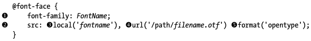
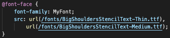

# Fonts*
proceed with font-weight

 

## ////////////////////////////// <@font-face()> 
 
CSS @-rule specifies a custom font with which to display text; the font can be loaded from either a remote server or a locally-installed font in the user’s own computer.
  
By allowing authors to provide their own fonts, @font-face makes it possible to design content without being limited to the so-called “web.safe” fonts (that is, the fonts which are so common that they’re considered to be universally available).   

You must first define a name for the font (e.g. FontName), and then point to the font file.

To use the aforementioned font ‘FontName’ you need only call its name in the font stack:

Example: rgd.html, 3rd part; rgd.css, 3rd part

**Property Values:**

<u>**font-family**</u> 

Required. Defines then name of the font, doesn’t refer to one.

<u>**src**</u> 

Required. Defines the URL(s) where the font should be downloaded from. If the local() function is provided, specifying a font name to look for on the user’s computer, and the user agent finds a match, that local font is used. Otherwise, the font resource specified using url() function is downloaded and used.

Example: Here I can supply different values for the src property by separating the values with commas, as I’ve done in the code example. This utilises the power of the cascade to allow different fall-back values, which will come in handy in a later example.

<u>**format**</u> 

Is used to specify the font type.

**WOFF / WOFF2** (Web Open Font Format)

Created for use on the web, WOFF fonts often load faster than other formats because they use a compressed version of the structure used by OPenType (OTF) and TrueType (TTF) fonts. This format can also include metadata and license info within the font file.

**WOFF2** is the next generation of WOFF and boasts better compression that the original.

**SVG / SVGZ** (Scalable Vector Graphics (Font))

An SVG is a vector re-creation of the font, which makes it a smaller file size, and is also great for mobile use. This format is the only one allowed by version 4.1 and below of Safari for iPhone.

SVGZ is a zipped version of SVG.

**EOT** (Embedded Open Type)

This format was created by Microsoft (the original innovators of @font-face) and is a proprietary file standard supported only by IE.

**OTF/TTF** (OpenType Font and TrueTypeFont)

The WOFF format was initially created as a reaction to OTF and TTF, in part, because these formats could easily (and illegally) be copied.

## ///////////////////////////// font-family 
 

Specifies a prioritised list of one or more font family names and/or generic family names for the selected element. The property specifies a list of fonts, from highest priority to lowest.

There are two types of font family names:

* **family-name**

The name of a font-family, like “times”, “courier”, “arial”, etc.

* **generic-family**

The name of a generic-family, like “serif”, “sans-serif”, “cursive”, “fantasy”, “monospace”.

Start with the font you want, and always end with a generic family, to let the browser pick a similar font in the generic family, if no other fonts are available.

**Note**: Separate each value with a comma.

**Note**: If the name of a font is more than one word, it must be in quotation marks, like: “Times New Roman”.

////////////////////////////// <font-style>

Specifies the font style for a text.

Example: text.html, 1st part; text.css, 1st part

Property Values:

normal:

The browser displays a normal font style. This is default.

italic:

The browser displays an italic font style.

oblique:

Selects a font that is classified as oblique. If no oblique version of the face is available, one classified as italic is used instead. Generally, there’s little, if any, difference between italic and oblique.
 

////////////////////////////// <font-weight>

Sets the weight (or boldness) of the font.

Property Values:

normal:

Defines normal characters. This is default.

