# Fonts

[font-face](#-font-face) <br>
[font-family](#-font-family) <br>
[font-size](#-font-size) <br>
[font-size-adjust](#-font-size-adjust) <br>
[font-style](#-font-style) <br>
[font-variant](#-font-variant) <br>
[font-weight](#-font-weight)

## //////////////////////////////////////////////////////////// <@font-face()>

<br>
CSS @-rule specifies a custom font with which to display text; the font can be loaded from either a remote server or a locally-installed font in the user’s own computer.
<br><br>
By allowing authors to provide their own fonts, @font-face makes it possible to design content without being limited to the so-called “web.safe” fonts (that is, the fonts which are so common that they’re considered to be universally available). <br><br>

You must first define a name for the font (e.g. FontName), and then point to the font file.

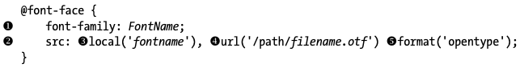

To use the aforementioned font ‘FontName’ you need only call its name in the font stack:

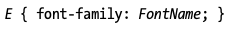

## Property Values:

<ins>**font-family**</ins>

Required. Defines then name of the font, doesn’t refer to one.

<ins>**src**</ins>

Required. Defines the URL(s) where the font should be downloaded from. If the local() function is provided, specifying a font name to look for on the user’s computer, and the user agent finds a match, that local font is used. Otherwise, the font resource specified using url() function is downloaded and used.

Example: Here I can supply different values for the src property by separating the values with commas, as I’ve done in the code example. This utilises the power of the cascade to allow different fall-back values, which will come in handy in a later example.

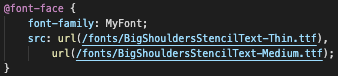

<ins>**format**</ins>

Is used to specify the font type.

**WOFF / WOFF2** (Web Open Font Format)

Created for use on the web, WOFF fonts often load faster than other formats because they use a compressed version of the structure used by OPenType (OTF) and TrueType (TTF) fonts. This format can also include metadata and license info within the font file.

**WOFF2** is the next generation of WOFF and boasts better compression that the original.

**SVG / SVGZ** (Scalable Vector Graphics (Font))

An SVG is a vector re-creation of the font, which makes it a smaller file size, and is also great for mobile use. This format is the only one allowed by version 4.1 and below of Safari for iPhone.

SVGZ is a zipped version of SVG.

**EOT** (Embedded Open Type)

This format was created by Microsoft (the original innovators of @font-face) and is a proprietary file standard supported only by IE.

**OTF/TTF** (OpenType Font and TrueTypeFont)

The WOFF format was initially created as a reaction to OTF and TTF, in part, because these formats could easily (and illegally) be copied.

## //////////////////////////////////////////////////////////// font-family

<br>

Specifies a prioritised list of one or more font family names and/or generic family names for the selected element. The property specifies a list of fonts, from highest priority to lowest.

There are two types of font family names:

- **family-name**

The name of a font-family, like “times”, “courier”, “arial”, etc.

- **generic-family**

The name of a generic-family, like “serif”, “sans-serif”, “cursive”, “fantasy”, “monospace”.

Start with the font you want, and always end with a generic family, to let the browser pick a similar font in the generic family, if no other fonts are available.

**Note**: Separate each value with a comma.

**Note**: If the name of a font is more than one word, it must be in quotation marks, like: “Times New Roman”.

<br>

## //////////////////////////////////////////////////////////// font-size

Sets the size of the text.

## Property Values:

<ins>**x-small, small, medium, large, x-large etc.**</ins>ins

Absolute-size keywords, based on the user's default font size (which is medium).

<ins>**larger, smaller**</ins>

Relative-size keywords. The font will be larger or smaller relative to the parent element's font size, roughly by the ratio used to separate the absolute-size keywords above.

<ins>**length**</ins>

For most font-relative units (such as _em_ and _ex_), the font size is relative to the parent element's font size.
<br>

## Pixels

Setting the font size in pixel values (_px_) is a good choice when you need pixel accuracy. A _px_ value is static. This is an OS-independent and cross-browser way of literally telling the browsers to render the letters at exactly the number of pixels in height that you specified. The results may vary slightly across browsers, as they may use different algorithms to achieve a similar effect.
<br>

**Note:** Defining font sizes in _px_ is <u>_not accessible_</u>, because the user cannot change the font size in some browsers. For example, users with limited vision may wish to set the font size much larger than the size chosen by a web designer.
<br>

## Em

Another way of setting the font size is with _em_ values. The size of an _em_ value is dynamic. When defining the _font-size_ property, an _em_ is equal to the font size of the element on which the _em_ is used. If you haven't set the font size anywhere on the page, then it is the browser default, which is often 16px. So, by default 1em = 16px, and 2em = 32px. <br>

If you set a _font-size_ of 20px on the body element, then 1em = 20px and 2em = 40px.

In order to calculate the _em_ equivalent for any pixel value required, you can use this:

> em = desired element pixel value / parent element font-size in pixels.

For example, suppose the font-size of the body of the page is set to 16px. If the font-size you want is 12px, then you should specify 0.75em (because 12/16 = 0.75). <br><br>

### <ins>**%**</ins>

Relative to the parent element's font size.

## Rem (root em)

The font behaves like the _em_, but instead of being relative to the _font-size_ value of the current element, it's relative to the _font-size_ value of the document root (the html element).

Although _em_ is quite useful, it's not without its drawbacks, which become most apparent when nesting elements.

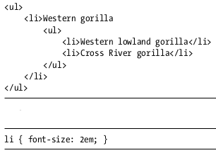 <br>

If you presume that the root font-size of the document is the common browser default of 16px, the first _li_ element will have a calculated font-size of 32px (16 \* 2). But the _font-size_ of the _li_ elements nested inside the first would be calculated relative to the inherited value, making them 64px (32 \* 2).

This is where the _rem_ unit becomes essential. Here's the same code as the previous example,only now using the _rem_ in place of the _em_ unit:

> li { font-size: 2rem; }

Again, presuming a root _font-size_ of 16px, the first _li_ has a calculated _font-size_ of 32px. This time, however, the _font-size_ of the nested _li_ elements is also relative to the root value, the same as their parent. And no matter how many nested layers down you go, that value is always relative to the root.

## Viewport Units

## VW

Developers tend to use %-values for layout elements, as they scale fluidly across the range of different screen sizes that websites need to cater to. Percentages are useful at a top level, but - as you just saw with _em_ units - you can run into difficulties when using % with nested elements.

This code illustrates the problem:

```
<div class="parent">
    <div class="child">...</div>
</div>
```

Now, imagine that `.parent` is 75% of the viewport width, and you want `.child` to be 65% of the viewport width - not the width of its parent. To do this, you have to divide 65 by 75, giving you a result of 86.666%. This calculation is simple enough, but the deeper the nesting goes, the more complex the calculations become.

A better solution is to use viewport-relative units - _vh_ and _vw_ - which represent viewport height and width, respectively. Each unit of value represents 1% of the appropriate viewport dimension: 1vh is 1% of the viewport height, and 1vw is 1% of the viewport width. For example, the following code makes an element 75% of the viewport width and 50% of its height:

```
E {
    height: 50vh;
    width: 75vw;
}
```

The advantage of using these units is that when elements are nested, the units remain relative to the viewport. So, in the case of my previous example, to make `.child` 65% of the total viewport width you simply do this:

```
.child {
    width: 65vw;
}
```

No Calculation Required!

## Example:

[rgd.html, 3rd part](html/rgd.html); <br>
[rgd.css, 3rd part](css/rgd.css) <br><br>

## //////////////////////////////////////////////////////////// font-size-adjust

Gives you better control of the font size when the first selected font is not available.

When a font is not available, the browser uses the second specified font. This could result in a big change for the font size.

The _font-size-adjust_ property sets the size of lower-case letters relative to the current font size (which defines the size of upper-case letters).ins

## Property Values:

<ins>**none**</ins>

Choose the size of the font based only on the _font-size_ property.

<ins>**number**</ins>

Choose the size of the font so that its lowercase letters (as determined by the x-height of the font) are the specified number times the _font-size_.

The number specified should generally be the aspect ratio (ratio of x-height to font size) of the first choice _font-family_. This means that the first-choice font, when available, will appear the same size in browsers, whether or not they support _font-size-adjust_.

`0` yields text of zero height (hidden text).

**Explanation:**

The only drawback in using font stacks in CSS is their size difference: your first choice font may look great at 16px, but if that font isn't available, the next fallback may appear smaller or have different proportions and be harder to read at that size. <br>
To combat this, the _font-size-adjust_ property lets you dynamically alter the _font-size_ property to ensure a regular appearance no matter which font is used from the stack. <br>
The _font-size-adjust_ property takes a single decimal value; here's the syntax:

```
E {
    font-size-adjust: number;
}
```

The _number_ value is the proportion of the total height that is occupied by a lowercase _x_ character (known as the _x-height_). In other words, a font might be 16px high in total, but the height of the lowercase _x_ might be half that (8px), which gives an x-height ratio of 0.5 (8 divided by 16):

```
p {
    font-size-adjust: 0.5;
}
```

By using _font-size-adjust_, you can ensure that no matter which font is displayed, the x-height always has the same value, and legibility does not suffer.

## Example:

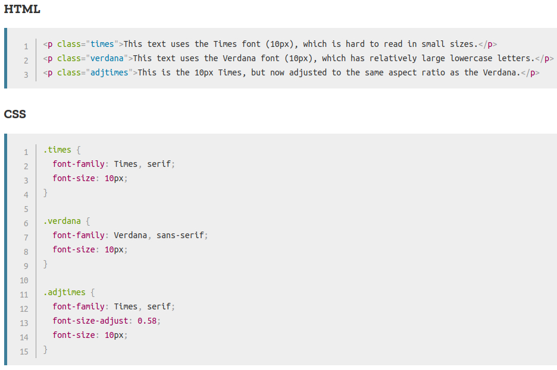

## Output:

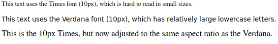

## Files:

[rgd.html, 3rd part](html/rgd.html) <br>
[rgd.css, 3rd part](css/rgd.css)

## //////////////////////////////////////////////////////////// font-style

<br>
Specifies the font style for a text.
<br><br>

## Property Values:

<ins>**normal**</ins>

The browser displays a normal font style. This is default.

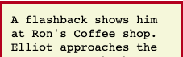

<ins>**italic**</ins>

The browser displays an italic font style.

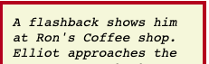

<ins>**oblique**</ins>

Selects a font that is classified as oblique. If no oblique version of the face is available, one classified as italic is used instead. Generally, there’s little, if any, difference between italic and oblique.

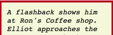

## Example:

[text.html, 1st part](html/text.html) <br>
[text.css, 1st part](css/text.css) <br><br>

## //////////////////////////////////////////////////////////// font-variant

<br>

Specifies whether or not a text should be displayed in a _small-caps_ font.

## Property Values:

<ins>**normal**</ins>

The browser displays a normal font. This is default.

[same as font-weight](#-font-weight)

<ins>**small-caps**</ins>

In small-caps font, all lowercase letters are converted to uppercase letters. However, the converted uppercase letters appears in a smaller font size than original uppercase letters in the text.

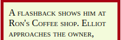

## //////////////////////////////////////////////////////////// font-weight

<br>
Sets the weight (or boldness) of the font. 
<br><br>

## Property Values:

<ins>**normal**</ins>

Defines normal characters. This is default. Same as 400.

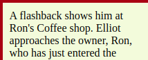

<ins>**bold**</ins>

Defines bold (thick) characters. Same as 700.


<ins>**bolder / lighter**</ins>

One relative font weight heavier/lighter than the parent element. For the full explanation see the section below: <br>

When _lighter_ or _bolder_ is specified, the below chart shows how the absolute font weight of the element is determined.

Note that when using relative weights, only four font weights are considered - thin (100), normal (700), bold (700) and heavy (900). If a font-family has more weights available, they are <u>ignored</u> for the purposes of relative weight calculation.

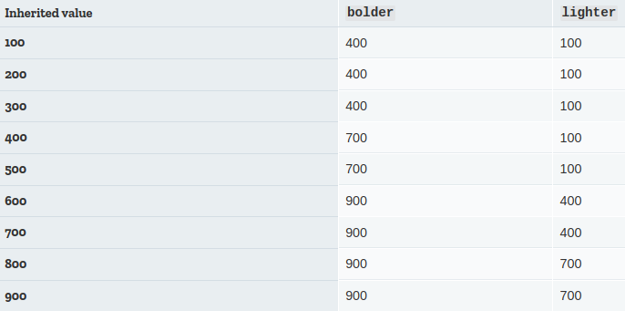

### Common weight name mapping:

The numerical values 100 to 900 roughly correspond to the following common weight names:

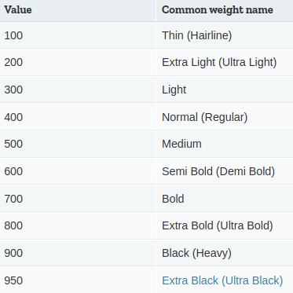
