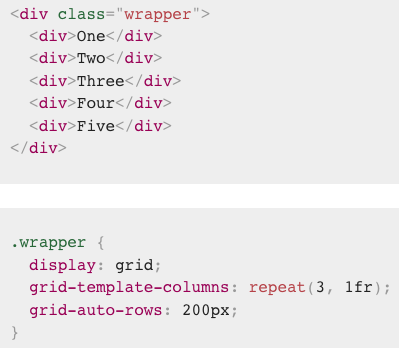
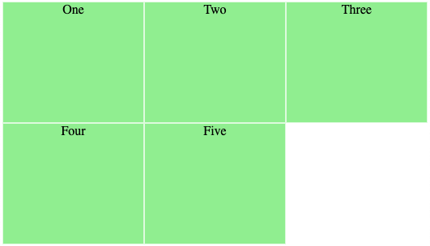
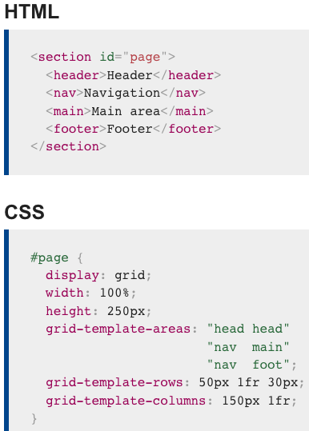
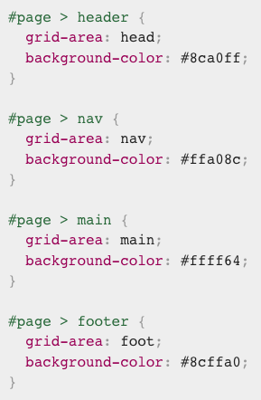
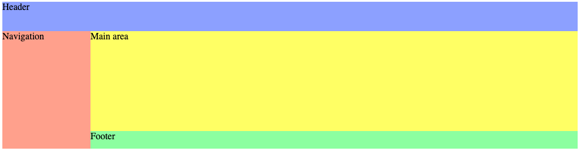

# Overview

[display](#-display)  
[Grid Template Area](#-grid-template-areas)  

## //////////////////////////////////////////////////////////// `display`

Defines the element as a grid container and establishes a new grid formatting context for its contents.

## Property Values:

<ins>**grid**</ins>

Generates a block-level grid container.

<ins>**inline-grid**</ins>

Generates an inline-level grid container.

[To Top](#overview)

## //////////////////////////////////////////////////////////// `grid-auto-row` & `grid-auto-column`

Specify the size of an implicitly-created grid row/column track or pattern of tracks.

If a grid item is positioned into a row that is not explicitly sized by `grid-template-rows`/`grid-template-columns`, implicit grid tracks are created to hold it.

**Alt:** So if more grid tracks are needed - then the grid creates rows and columns in the implicit grid. These tracks will be auto-sized by default, resulting in their size being based on the content that is inside them.

Example below uses `grid-auto-rows` to ensure that tracks created in the implicit grid are <code>200px</code> tall.

  
  

[To Top](#overview)

## //////////////////////////////////////////////////////////// `grid-template-areas`

Defines a grid template by referencing the names of the grid areas which are specified with the `grid-area` property. Repeating the name of a grid area causes the content to span those cells. A period (`.`) signifies an empty cell. The syntax itself provides a visualization of the structure of the grid.

Take a look at following example:

  
  
  

By repeating _head_ area two times will cause our header span over two columns. On the other side the _nav_ area spans two rows cells.

[To Top](#overview)

## //////////////////////////////////////////////////////////// `grid-template-rows` & `grid-template-columns`

Defines the columns and rows of the grid with a space-separated list of values. The values represent the track size, and the space between them represents the grid line.
