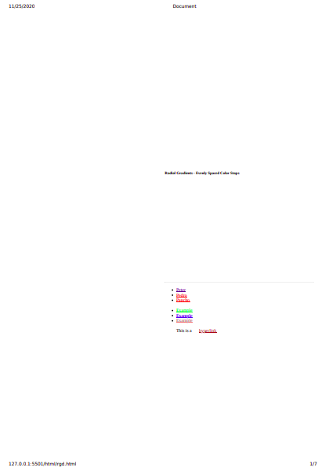

# Links

[:active-pseudo-selector](#-active)  
[list-style-position](#-list-style-position)  
[list-style-type](#-list-style-type)  

## //////////////////////////////////////////////////////////// :active

The `:active` pseudo-class (pseudo selector) represents an element (such as button) that is being activated by the user. When using a mouse, "activation" typically starts when the user presses down the primary mouse button.

The `:active` pseudo-class is commonly used on `<a>` and `<button>` elements.

**Note:**Styles defined by the `:active` pseudo-class will be overridden by any subsequent link-related pseudo-class(`:link`, `:hover`, or `:visited`) that has at least equal specificity.

To style links appropriately, put the `:active` rule after all other link-related rules, as defined by the (_LoVe-HAte_-order): `:link` - `:visited` - `:hover` - `:active`.

## Example:

Here's the button before being clicked:  

Here's the button being clicked:  

## Example Files:

[lists.html 2nd part](html/lists.html)  
[lists.css 2nd part](css/lists.css)  

## //////////////////////////////////////////////////////////// :first

The `:first` pseudo-class, used with @-rule, represents the first page of a printed document.

**Note:** You can't change all CSS properties with this pseudo-class. You can only change the margins, orphans, widows, and page breaks of hte document. Furthermore, you may only use absolute-length units when defining the margins. All other properties will be ignored.

## Example:

Press the "Print!" button to print the example. The words on the first page should be somewhere around the center,...

... while other pages will have their contents at the default position.  

## Example Files:

[rgd.html 4th part](html/rgd.html)  
[rgd.css 4th part](css/rgd.css)  
