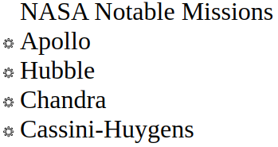
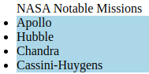
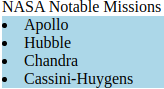
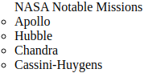
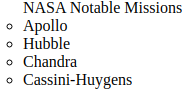
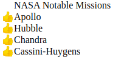
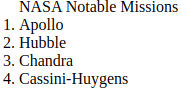

# Lists

[list-style-image](#-list-style-image)  
[list-style-position](#-list-style-position)  
[list-style-type](#-list-style-type)  

## //////////////////////////////////////////////////////////// list-style-image

Sets an image to be used as the list item marker.

## Property Values:

<ins>**url**</ins>

The path to the image to be used as a list-item marker. In example figure the load icon is used.

## Example Files:

[lists.html, 1st part](html/lists.html)  
[lists.css, 1st part](css/lists.css)

## //////////////////////////////////////////////////////////// list-style-position

Specifies the position of the list-item markers (bullet points).

## Property Values:

<ins>**outside**</ins>

The bullet points will be outside the list item. <ins>This is default.</ins>

<ins>**inside**</ins>

The bullet points will be inside the list item.

## Example Files:

[lists.html, 1st part](html/lists.html)  
[lists.css, 1st part](css/lists.css)

## //////////////////////////////////////////////////////////// list-style-type

 

Specifies the type of list item marker (such as a disc, character, or custom counter style) of a list item element.

## Property Values:

<ins>**none**</ins>

No item marker is shown.

<ins>**disc**</ins>

Default value. The marker is a filled circle.

<ins>**circle**</ins>

The marker is a hollow circle.

<ins>**string**</ins>

The specified string will be used as the item's marker.

<ins>**decimal**</ins>

The marker is a number.

<ins>**custom-ident**</ins>

A identifier matching the value of a `@counter-style` or one of the predefined styles.

<ins>**for other values check the official site**</ins>

## Example Files:

[lists.html, 1st part](html/lists.html)  
[lists.css, 1st part](css/lists.css)
