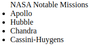

# Lists

[list-style-type](#-list-style-type)  

## //////////////////////////////////////////////////////////// list-style-type

 

Specifies the type of list item marker (such as a disc, character, or custom counter style) of a list item element.

## Property Values:

<u>**none**</u>

No item marker is shown.

<u>**disc**</u>

Default value. The marker is a filled circle.

<u>**circle**</u>

The marker is a hollow circle.

<u>**string**</u>

The specified string will be used as the item's marker.

<u>**decimal**</u>

The marker is a number.

<u>**custom-ident**</u>

A identifier matching the value of a `@counter-style` or one of the predefined styles.

<u>**for other values check the official site**</u>

## Example Files:

[lists.html, 1st part](html/lists.html)  
[lists.css, 1st part](css/lists.css)

## //////////////////////////////////////////////////////////// list-style-image

Sets an image to be used as the list item marker.

## Property Values:

<u>**url**</u>

The path to the image to be used as a list-item marker. In example figure the load icon is used.

## Example Files:

[lists.html, 2nd part](html/lists.html/#1st_part)  
[lists.css, 2nd part](css/lists.css)

[This is the link to the 1st part](http://127.0.0.1:5501/html/test.html/#1st_part) 

[This is the link to the 2nd part in test.html](html/test.html/#2nd_part)

 

[This is the link to the 2nd part in test.html](http://127.0.0.1:5501/html/test.html/#2nd_part)
