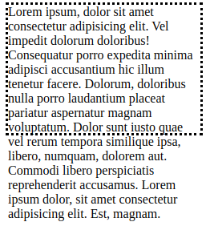
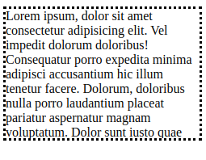
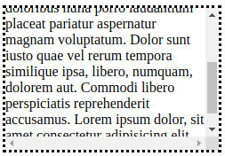

# Overflow

[overflow](#-overflow)  
[overflow-x](#-overflow-x)  
[overflow-y](#-overflow-y)  

## //////////////////////////////////////////////////////////// overflow

Sets the desired behavior for an element's overflow - i.e. when an element's content is too big to fit in its block formatting context - in both directions.

## Property Values:

<ins>**visible**</ins>

Default. The overflow is not clipped and may be rendered outside the padding box.

<ins>**hidden**</ins>

The overflow is clipped, and the rest of the content will be invisible in order to fit the padding box. No scrollbars are provided, and no support for allowing the user to scroll (scroll wheel) is allowed.

<ins>**scroll**</ins>

The overflow is clipped, but a scroll-bar is added to see the rest of the content.

<ins>**auto**</ins>

Depends on the user agent (browser). If content fits inside the padding box, it looks the same as _visible_, but still establishes a new block formatting context. Desktop browsers provide scrollbars if content overflows.

**Alternative:** Similar to _scroll_, but it adds scrollbars only when necessary.

## Example Files:

[links.html, 2nd part](html/links.html)  

[To Top](#overflow)

## //////////////////////////////////////////////////////////// overflow-x

Specifies whether to clip the content, add a scroll bar, or display overflow content of a block-level element, when it overflows at the <ins>left and right edges</ins>.

## Property Values:

Same as in [overflow](#-overflow)  

[To Top](#overflow)

## //////////////////////////////////////////////////////////// overflow-y

Specifies whether to clip the content, add a scroll bar, or display overflow content of a block-level element, when it overflows at the <ins>top and bottom edges</ins>.

## Property Values:

Same as in [overflow](#-overflow)  

[To Top](#overflow)
