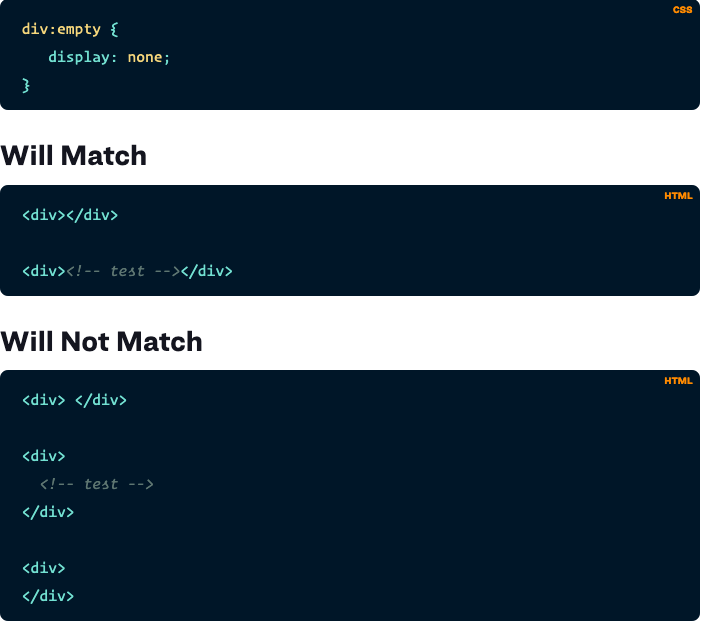

# Pseudo-Elements & -Classes

# Pseudo-Elements

[::after & ::before](#-after---before)  
[::first-letter](#-first-letter)  
[::first-line](#-first-line)  
[::selection](#-first-line)  

# Pseudo-Classes

[:active](#-active)  
[:any-link](#-any-link)  
[:checked](#-checked)  
[:empty](#-empty)  
[:enabled](#-enabled)  
[:first](#-first)  
[:first-child](#-first-child)  
[:first-of-type](#-first-of-type)  
[:focus](#-focus)  
[:hover](#-hover)  
[:in-range](#-in-range)  
[:invalid](#-invalid)  
[:last-child](#-last-child)  
[:link](#-link)  
[:not](#-not)  
[:nth-child](#-nth-child)  
[:nth-last-child](#-nth-last-child)  
[:nth-last-of-type](#-nth-last-of-type)  
[:nth-of-type](#-nth-of-type)  
[:only-of-type](#-only-of-type)  
[:optional](#-optional)  
[:out-of-range](#-in-range)  
[:required](#-optional)  
[:valid](#-valid)  
[:visited](#-visited)  

Pseudo elements are used to style specified parts of an element.

## //////////////////////////////////////////////////////////// ::after & :: before

The `::after` selector inserts something after the content of each selected element(s).

Use the <ins>content</ins> property to specify the content to insert.

Use the <ins>`::before`</ins> selector to insert something before the content.

## Example:

## Example Files:

[pseudo.html 4th part](html/pseudo.html)  

[To Top](#pseudo-elements---classes)

## //////////////////////////////////////////////////////////// ::first-letter

Applies styles to the first letter of the first line of a block-level element, but only when not preceded by other content (such as images or inline tables).

## Example:

## Example Files:

[lists.html 1st part](html/lists.html)  

[To Top](#pseudo-elements---classes)

## //////////////////////////////////////////////////////////// ::first-line

Applies to the first line of a block-level element.

**Note:** The length of first line depends on many factors, including the width of the element, the width of the document, and the font size of the text.

## Example:

## Example Files:

[lists.html 4th part](html/lists.html)  

[To Top](#pseudo-elements---classes)

## //////////////////////////////////////////////////////////// ::selection

Applies styles to the part of a document that has been highlighted by the user (such as clicking and dragging the mouse across text).

Only certain CSS properties can be used with `::selection`:

- color
- background-color
- cursor
- caret-color
- outline
- text-decoration
- text-shadow

## Example:

## Example Files:

[pseudo.html 4th part](html/pseudo.html)

[To Top](#pseudo-elements---classes)

# Pseudo-Classes

## //////////////////////////////////////////////////////////// :active

The `:active` pseudo-class (pseudo selector) represents an element (such as button) that is being activated by the user. When using a mouse, "activation" typically starts when the user presses down the primary mouse button.

The `:active` pseudo-class is commonly used on `<a>` and `<button>` elements.

**Note:**Styles defined by the `:active` pseudo-class will be overridden by any subsequent link-related pseudo-class(`:link`, `:hover`, or `:visited`) that has at least equal specificity.

To style links appropriately, put the `:active` rule after all other link-related rules, as defined by the (_LoVe-HAte_-order): `:link` - `:visited` - `:hover` - `:active`.

## Example:

Here's the button before being clicked:  

Here's the button being clicked:  

## Example Files:

[lists.html 2nd part](html/lists.html)  

[To Top](#pseudo-elements---classes)

## //////////////////////////////////////////////////////////// :any-link

Represents an element that acts as the source anchor of a hyperlink, independent of whether it has been visited. In other words, it matches every `<a>`, `<area>`, or `<link>` element that <ins>has an `href` attribute</ins>. Thus, it matches all elements that match `:link` or `:visited`.

## Example:

## Example Files:

[pseudo.html 5th part](html/pseudo.html)

[To Top](#pseudo-elements---classes)

## //////////////////////////////////////////////////////////// :checked

Selects elements when they are in the selected state. It is only associated with `<input>` elements of type radio and checkbox. The `:checked` pseudo-class selector matches radio and checkbox input types when checked or toggled to an `on` state.

## Example:

## Example Files:

[To Top](#pseudo-elements---classes)

## //////////////////////////////////////////////////////////// :empty

The `:empty` pseudo selector will select elements that contain either nothing or only an HTML comment.

It's useful for hiding empty elements that might cause weird spacing (e.g. they have padding). Or something like removing the border from the top-left table cell element in a cross-referencing table.

## Example:

**No example files.**

[To Top](#pseudo-elements---classes)

## //////////////////////////////////////////////////////////// :enabled

Represents any enabled element. An element is enabled if it can be activated (selected, clicked on, typed into, etc.) or accept focus, otherwise it is disabled. It is only associated with form elements (`<input>`, `<select>`, `<textarea>`).

## Example:

## Example Files:

[lists.html 9th part](html/lists.html)

[To Top](#pseudo-elements---classes)

## //////////////////////////////////////////////////////////// :first

The `:first` pseudo-class, used with @-rule, represents the first page of a printed document.

**Note:** You can't change all CSS properties with this pseudo-class. You can only change the margins, orphans, widows, and page breaks of hte document. Furthermore, you may only use absolute-length units when defining the margins. All other properties will be ignored.

## Example:

Press the "Print!" button to print the example. The words on the first page should be somewhere around the center,...

... while other pages will have their contents at the default position.  

## Example Files:

[rgd.html 4th part](html/rgd.html)  

[To Top](#pseudo-elements---classes)

## //////////////////////////////////////////////////////////// :first-child

Represents the first element among a group of sibling elements.

## Example:

## Example Files

[lists.html 3rd part](html/lists.html)  

[To Top](#pseudo-elements---classes)

## //////////////////////////////////////////////////////////// :first-of-type

Represents the first element of its type among a group of sibling elements.

## Example:

## Example Files:

[lists.html 5th part](html/lists.html)  

[To Top](#pseudo-elements---classes)

## //////////////////////////////////////////////////////////// :focus

Represents an element (such as a form input) that has received focus. It is generally triggered when the user clicks or taps on an element or selects it with the keyboard's `Tab` key.

## Example:

## Example Files:

[rgd.html 4th part](html/rgd.html)  

[To Top](#pseudo-elements---classes)

## //////////////////////////////////////////////////////////// :hover

Matches when the user interacts with an element with a pointing device (such as mouse), but does not necessarily activate it.

**Tip:** Use the `:link` selector to style links to unvisited pages, the `:visited` selector to style links to visited pages, and the `:active` selector to style the active link.

**Note:** `:hover` MUST come after `:link` and `:visited` (if they are present) in the CSS definition, in order to be effective!

**Note:** Make sure that content is accessible on devices with limited or non-existent hovering capabilities. Depending on the browser, the `:hover` pseudo-class might never match, match only for a moment after touching an element, or continue to match even after the user has stopped touching.

## Example Files:

[rgd.html 4th part](html/rgd.html)  

[To Top](#pseudo-elements---classes)

## //////////////////////////////////////////////////////////// :in-range

Represents an `<input>` element whose current value is within the range limits specified by the `min` and `max` attributes.

**Tip:** Use the <ins>`:out-of-range`</ins> selector to select all elements with a value that is outside a specified range.

**NOTE:** An empty `<input>` does not count as out of range, and will not be selected using the `:out-of-range` pseudo-class selector. You could also use the `required` attribute and the `:invalid` pseudo-class to provide more general logic and styling for making inputs mandatory (`:invalid` will style bland _and_ out-of-range inputs).

In example below, the input will have a green border when its value is between 5 and 10. Also the border's width gets <ins>longer</ins> if the value is in range and <ins>shorter</ins> if it is out of range.

## Example Files:

[pseudo.html 2nd part](html/pseudo.html)  

[To Top](#pseudo-elements---classes)

## //////////////////////////////////////////////////////////// :indeterminate

Selects form elements that are in an intermediate state that is neither checked nor unchecked. It's that in-between state that we might consider the "Maybe" between "Yes" and "No" options. The state is not fully determined, hence the name: indeterminate.

Elements targeted by this selector are:

- `<input type="checkbox">` elements whose `indeterminate` property is set to `true` by JavaScript
- `<input type="radio">` elements, when all radio buttons with the same `name` value in the form are unchecked
- `<progress>` elements in an indeterminate state

Here we can see the indeterminate state implemented for a third checkbox:

There are no example files for the discussed pseudo-element because the implementation requires the knowledge of JavaScript.

## //////////////////////////////////////////////////////////// :invalid

The `:invalid` selector allows you to select `<input>` elements that do not contain valid content, as determined by its `type` attribute.

Following example shows a form that colors elements green when they validate and red when they don't.

Note how the first `<input>` ("Email") is green - valid - even when there is no content in the field. This is because the input is optional, so leaving it blank would result in a valid submission. To fix this behaviour, the second `<input>` has a "required" attribute, which means that a blank field would result in an invalid form submission.

## Example Files:

[pseudo.html 1st part](html/pseudo.html)  

[To Top](#pseudo-elements---classes)

## //////////////////////////////////////////////////////////// :last-child

Represents the last element among a group of sibling elements.

Using `:last-child` is very similar to `:last-of-type` but with one **critical difference:** it is <ins>less specific</ins>. `:last-child` will only try to match the very last child of a parent element, while `last-of-type` will match the last occurrence of a specified element, even if it doesn't come dead last in the HTML.

## Example Files:

[lists.html 1st part](html/lists.html)  

[To Top](#pseudo-elements---classes)

## //////////////////////////////////////////////////////////// :link

Represents an element that has not yet been visited. It matches every unvisited `<a>`, `<area>`, or `<link>` element that has an `href` attribute.

**Note:** The `:link` selector does not style links you have already visited.

## Example:

## Example Files:

[lists.html 8th part](html/lists.html)  

[To Top](#pseudo-elements---classes)

## //////////////////////////////////////////////////////////// :not()

Represents elements that do not match a list of selectors. Since it prevents specific items from being selected, it is known as the _negation pseudo-class_.

## Implementation:

## Example:

This example shows the exclusion of all the html elements except for the last class ".notIt" which border is colored yellow-green.

## Example Files:

[text.html 5th part](html/text.html)  

[To Top](#pseudo-elements---classes)

## //////////////////////////////////////////////////////////// :nth-child()

Matches elements based on their position in a group of siblings.

`:nth-child()` takes a single argument that describes a pattern for matching element indices in a list of siblings.

## Keyword Values:

<ins>**odd**</ins>

Represents elements whose numeric position in a series of siblings is odd: 1, 3, 5, etc.

<ins>**even**</ins>

Represents elements whose numeric position in a series of siblings is even: 2, 4, 6 etc.

## Functional Notation:

<ins>**An+B**</ins>

Represents elements in a list whose indices match those found in a custom pattern of numbers, defined by _An+B_, where:

- `A` is an integer step size,
- `B` is an integer offset,
- `n` is all positive integers, starting from 0.

It can be read as the *An+B*th element of a list.

## Examples:

## Example Files:

[lists.html 6th part](html/lists.html)  

[To Top](#pseudo-elements---classes)

## //////////////////////////////////////////////////////////// :nth-last-child()

Matches elements based on their position among a group of siblings, counting from the end.

**Note:** This pseudo-class is essentially the same as `:nth-child`, except it counts items backwards from the _end_, <ins>not</ins> forwards from the beginning.

## Example Files:

[lists.html 6th part](html/lists.html)  

[To Top](#pseudo-elements---classes)

## //////////////////////////////////////////////////////////// :nth-last-of-type()

Matches elements of a given type, based on their position among a group of siblings, counting from the end.

**Note:** This pseudo-class is essentially the same as `:nth-of-type`, except it counts items backwards from the _end_, <ins>not</ins> forwards from the beginning.

## Example:

## Example Files:

[lists.html 7th part](html/lists.html)  

[To Top](#pseudo-elements---classes)

## //////////////////////////////////////////////////////////// :nth-of-type()

Matches elements of a given type (tag name), based on their position among a group of siblings.

## Example:

  
  

## There are no example files:

[To Top](#pseudo-elements---classes)

## //////////////////////////////////////////////////////////// :only-of-type

Represents an element that has no siblings of the same type.

## Example:

## Example Files:

[lists.html, 7th part](html/lists.html)  

[To Top](#pseudo-elements---classes)

## //////////////////////////////////////////////////////////// :optional

Represents any `<input>`, `<select>`, or `<textarea>` element that does not have the `required` attribute set on it.

**Note:** The `:required` pseudo-class selects _required_ form fields.

## Example:

## Example Files:

[pseudo.html 6th part](html/pseudo.html)  

[To Top](#pseudo-elements---classes)

## //////////////////////////////////////////////////////////// :valid

Represents any `<input>` or other `<form>` element whose contents validate successfully. This allows to easily make adopt an appearance that helps the user confirm that their data is formatted properly.

**Note:** The `:valid` selector only works for form elements with limitations, such as input elements with min and max attributes, email fields with a legal email, or number fields with a numeric value, etc.

Following example shows that by trying to type in an illegal e-mail address the styling (which is background-color) will disappear.

## Example Files:

[links.html 1st part](html/links.html)  

[To Top](#pseudo-elements---classes)

## //////////////////////////////////////////////////////////// :visited

Represents links that the user has already visited. For privacy reasons, the styles that can be modifed using this selector are very limited.

For more information on restriction for `:visited` pseudo-element, visit the official [MDN web docs](https://developer.mozilla.org/en-US/docs/Web/CSS/:visited).

[To Top](#pseudo-elements---classes)

