# Selectors & Combinators

[universal selector](#universal-selector-)  
[type selector](#-type-selector)  
[class selector](#-class-selector)  
[id selector](#-id-selector)  
[attribute selectors](#-attribute-selector)  
[child-combinator](#-child-combinator)  
[adjacent-sibling-combinator](#-adjacent-sibling-combinator)  
[general-sibling-combinator](#-general-sibling-combinator)  

## //////////////////////////////////////////////////////////// Universal Selector

Matches elements of any type.

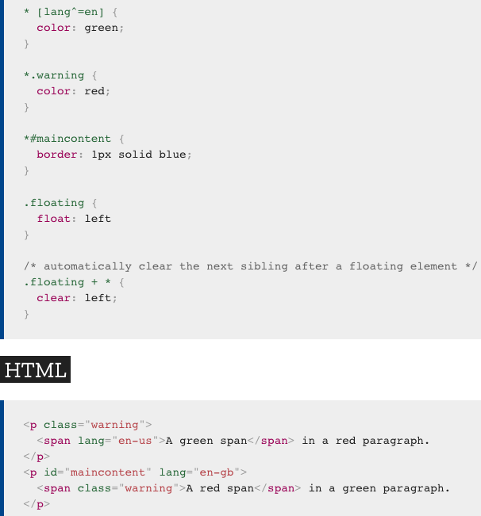
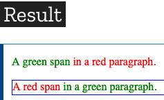

## Example Files:

[selector.html, 1st part](html/selector.html)  

[To Top](#selectors--combinators)

## //////////////////////////////////////////////////////////// Type Selector

Matches elements by node name. In other words, it selects all elements of the given type within a document.

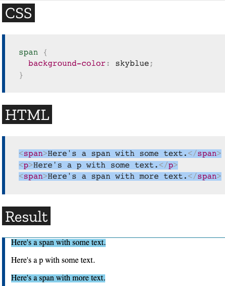

## Example Files:

[selector.html, 2nd part](html/selector.html)  

[To Top](#selectors--combinators)

## //////////////////////////////////////////////////////////// Class Selector

Matches elements based on the contents of their `class` attribute.

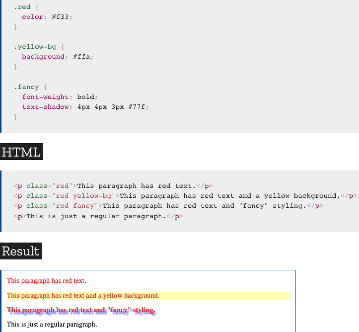

## Example Files:

**No Files**

[To Top](#selectors--combinators)

## //////////////////////////////////////////////////////////// ID Selector

Matches an element based on the value of the element's `id` attribute. In order for the element to be selected, its `id` attribute must match exactly the value given in the selector.

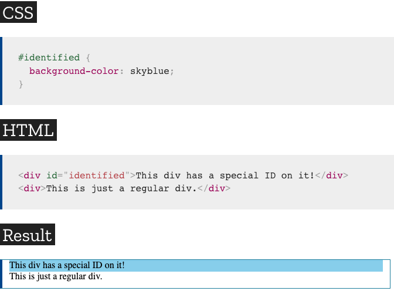

## Example Files:

**No Files**

[To Top](#selectors--combinators)

## //////////////////////////////////////////////////////////// Attribute Selector

Is used to select elements with a specified attribute.

<ins>**[attribute]**</ins>

Is used to select elements with a specified attribute.

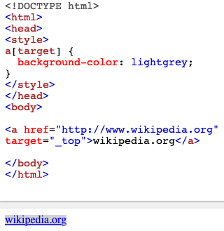

<ins>**[attribute=value]**</ins>

Is used to select elements with a specified attribute and value.

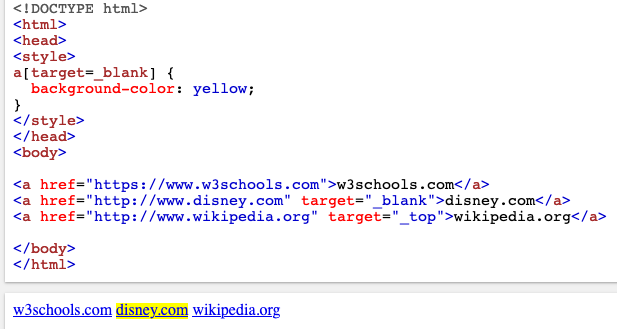

<ins>**[attribute~=value]**</ins>

Is used to select with an attribute value containing a specified word.

Following example selects all elements with a title attribute that contains a space-separated list of words, one of which is "flower":

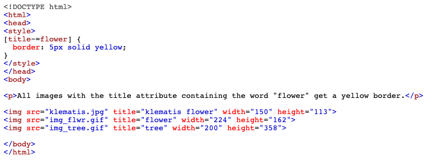
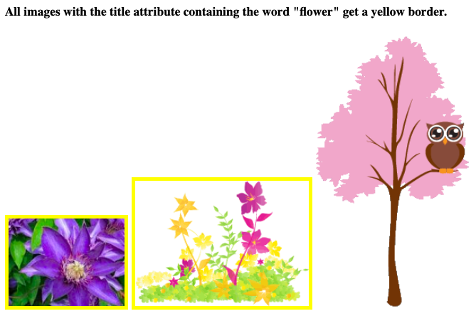

<ins>**[attribute^=value]**</ins>

Matches every element whose attribute value begins with a specified value. Don't forget, case-sensitivity matters.

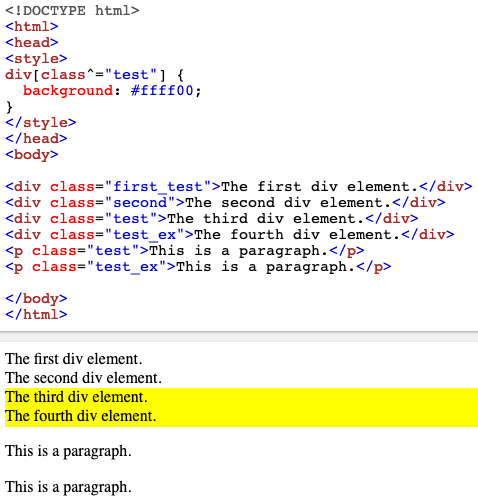

<ins>**[attribute|=value]**</ins>

Is used to select elements with the specified attribute starting with the specified value.

**Alt:** This selector is very similar to the "starts with" selector. Here, it matches a value that is either the only value or is the _first_ in a dash-separated list of values.

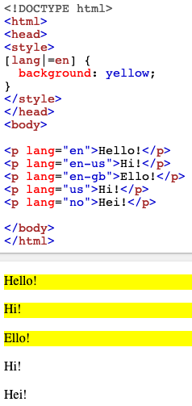

<ins>**[attribute$=value]**</ins>

Matches every element whose attribute value ends with a specified value.

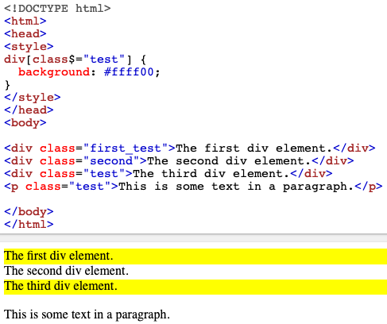

<ins>**[attribute*=value]**</ins>

Matches every element whose attribute value containing a specified value.

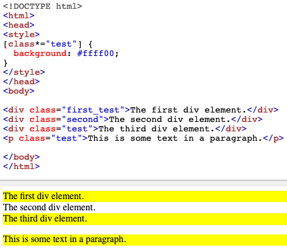

## Example Files:

**No Files**  

[To Top](#selectors--combinators)  

# Combinators

## //////////////////////////////////////////////////////////// Child Combinator

The child combinator (`>`) is placed between two CSS selectors and is used to select elements with a specific parent.

**Note:** Elements that are not directly a child of the specified parent, are not selected.

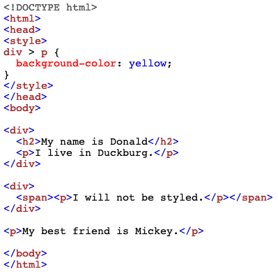
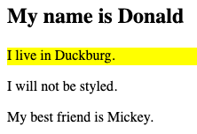

## //////////////////////////////////////////////////////////// Adjacent Sibling Combinator

Is used to select an element that is directly after another specific element.

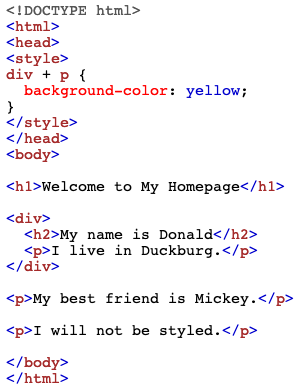
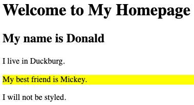

## //////////////////////////////////////////////////////////// General Sibling Combinator

The _element1~element2_ selector matches occurrences of _element2_ that are preceded by _element1_. Both elements must have the same parent, but _element2_ does not have to be immediately preceded by _element1_.

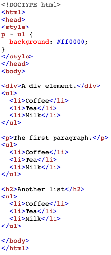  
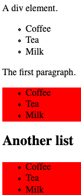
