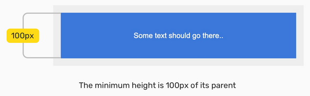
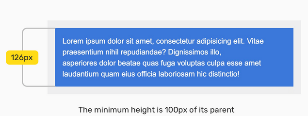
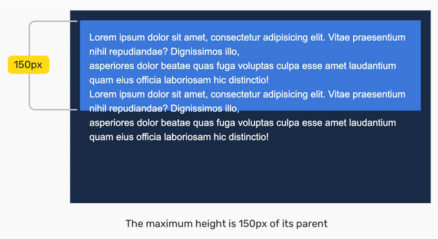
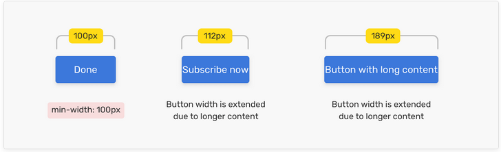
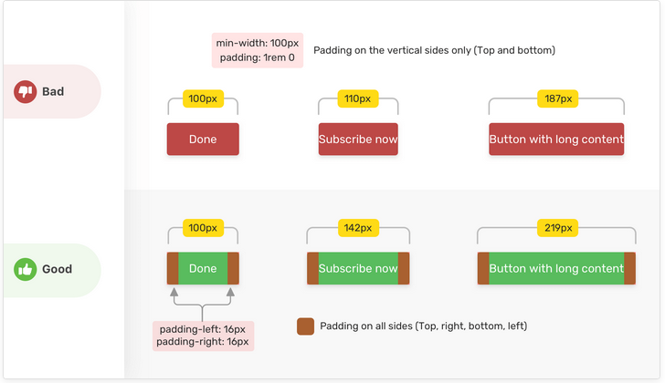
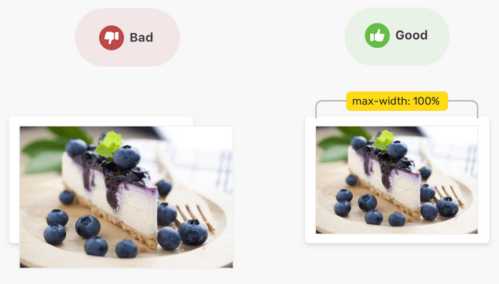
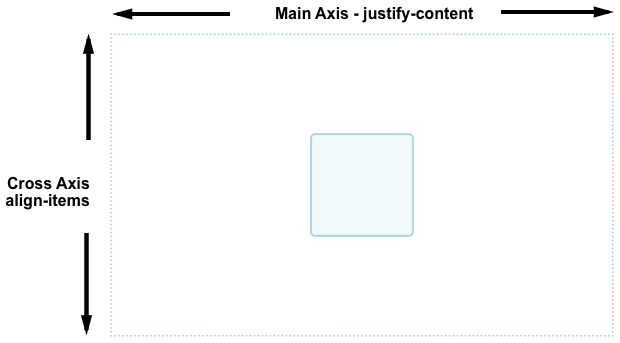
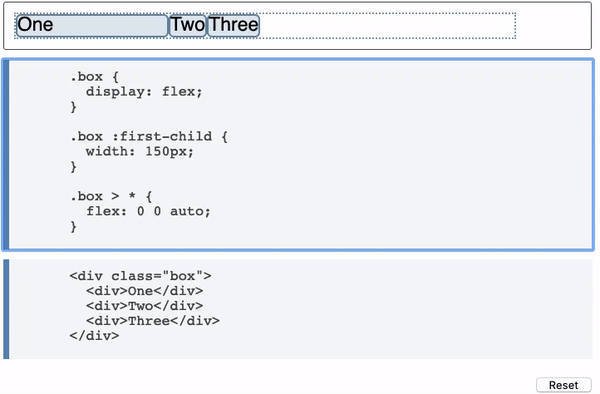
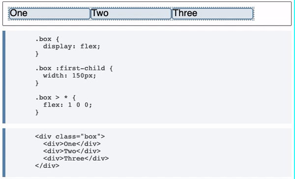

# Overview

[Box Model](#-box-model) <br>
[Box Sizing](#the-box-sizing-property) <br>
[Box Model Example](#example) <br>
[Minimum Height](#-min-height) <br>
[Maximum Height](#-max-height) <br>
[Minimum Width](#-min-width) <br>
[Maximum Width](#-max-width) <br>
[Vertical Alignment](#-vertical-alignment) <br>
[Aligning Items in a Flex Container](#-aligning-items-in-a-flex-container) <br>

# Layouts

## //////////////////////////////////////////////////////////// Box-Model

The <ins>box model</ins> is for formula upon which layout boxes are based, and comprises content, padding, border, and margin. CSS lets you alter these values to change the overall site and shape of elements' display.


If you are a Firebug user, you might be used to the diagram like this, which does a nice job of showing you the numbers affecting any box on the page:


The size of the box itself is calculated like this:

| Size       | Calculation                                                        |
| ---------- | ------------------------------------------------------------------ |
| **Width**  | width + padding-left + padding-right + border-left + border-right  |
| **Height** | height + padding-top + padding-bottom + border-top + border-bottom |

<br>

## The `display` property

Block elements assume all of the available space in one dimension. Typically, this is the horizontal dimension, because the `writing-mode`is set to `horizontal-tb`.


If a box is defined as a block, it will behave in the following ways:

- The box will break onto a new line.
- The box will extend in the inline direction to fill the space available in its container. In most cases this means that the box will become as wide as its container, filling up 100% of the space available.
- The _width_ and _height_ properties are respected.
- Padding, margin and border will cause other elements to be pushed away from the box

<ins>Inline</ins> elements behave differently. THey are laid out <ins>in line</ins> with the current context, writing mode, and direction. They are only as wide as their content, and are placed adjacently wherever there is space to do so. Block elements follow 'flow direction' (from top to bottom), and inline elements follow writing direction.


If a box has an outer display type of `inline`, then:

- The box will not break onto a new line.
- The _width_ and _height_ properties will bot apply.
- Vertical padding, margins, and borders will apply but will not cause other inline boxes to move away from the box.
- Horizontal padding, margins, and borders will apply and will cause other inline boxes to move away from the box.

Thinking typographically, it could be said that <ins>block elements are like paragraphs, and inline elements are like words</ins>.

**Block elements** (also called <ins>block-level</ins> elements) afford you control over both the horizontal and vertical dimensions of the box. That is, you can apply width, height, margin, and padding to a block element and it will take effect.
On the other hand, inline elements are sized _intrinsically_ (prescribed width and height values do not take effect) and only _horizontal_ margin and padding values are permitted. Inline elements are designed to conform to the flow of horizontal placement among other inline elements.

`Inline-block` is a hybrid of `block`and `inline`. You can set vertical properties on _inline-block_ elements, although this is not always desirable - as the proceeding illustration demonstrates.


[To Top](#overview)

## Content in Boxes

Without intervention, it is the contents of an element that determines its size and shape. Content makes `inline` elements grow horizontally, and `block` elements grow vertically. Left to its own devices, the area of a box is determined by the area of the content it contains. Because web content is _dynamic_ (subject to change), static representations of web layouts ar extremely misleading.

## The `box-sizing` property

By default, the dimensions of a box are the dimensions of the box's content _plus_ its padding and border values (implicitly: `box-sizing`: `content-box`). That is, if you set an element to be 10rem wide, then add padding on both sides of 1rem, it will be 12rem wide:

```
10rem + 1rem of left padding + 1rem of right padding
```

If you opt for `box-sizing`: `border-box`, the content area is reduced to accommodate the padding and the total width equals the prescribed width of 10rem.

<ins>**Generally**</ins>, it is considered preferable to use the `border-box` model for all boxes. It makes calculating/anticipating box dimensions easier.

Any styles, like `box-sizing: border-box`, that are applicable to all elements are best applied using the * ("wildcard") selector. Being able t affect the layout of multiple elements (in this case, *all\* elements) simultaneously is how CSS brings efficiency to layout design.

```
* {
    box-sizing: border-box;
}
```

**Alt:** To ensure the parent element retains a height of `100vh`, despite the additional padding, a `box-sizing: border-box` value must be applied. Where it is not, the padding is _added_ to the total height.

Only where the height or width of a box is constrained does the difference between `content-box`and `border-box` come into play.

For illustration, consider a block element placed inside another block element. Using the `content-box` model and a padding of `1rem`, the child elemet will overflow by `2rem` when `width: 100%` is applied.


Why? Because `width: 100%` means _"make the width of this element the same as the parent element"_. Since we are using the `content-box` model, the _content_ is made 100% wide, then the padding is added on to this value.

But if we use `width: auto` (we can just remove `width: 100%`, since `auto` is the default value) the child within the parent box perfectly. And that's _regardless_ of the `box-sizing` value.


Implicitly, the `height` is also set to `auto`, meaning it is derived from the content. Again, `box-sizing` has no effect.

## What if these values are undeclared?

If padding or borders are undeclared, they are either zero (likely if you are using a [css reset](https://css-tricks.com/poll-results-what-css-reset-do-you-use/)) or the browser default value (probably **not** zero especially on form elements that are commonly not reset). More on that read below in [CSS Reset section](#-CSS-Reset)

[To Top](#overview)

## Example:

Lets recreate following example from: [Gradient Hero.](https://github.com/RafEissen/Exercises/blob/main/December/exercises.md#gradient-hero)

Here is the mockup picture:


Here is the HTML-code:


### First Part

Initially we can divide the screen in two parts. First part is going to be filled with image as a background property. For that to happen we have to create a box by mentioning only the visual height of `75vh`:

> height: 75vh;

Once the box is established, we can start to implement our image as a background together with multiple gradient stops. In order to center the image we have to mention `background-position: center` as well as `no-repeat` in order for the image stop repeating itself and also fully cover the given container section.

Here is the CSS snippet:

> background-repeat: no-repeat; <br>
> background-position: center; <br>
> background-size: cover;<br>

Finally we can apply our `linear-gradient` property on the picture and start with the second part of the exercise.

[To Top](#overview)

### Second Part

Second part is text part with a black `background-color` property which is wrapped in another `<section>` called _txt_half_. In the beginning we can crate distance from the 1st half by mentioning the top-bottom `padding` property:

```
.txt_half {
  background-color: black;
  padding: 3.75rem 0;
  color: rgba(255, 255, 255, 0.8);
}
```

Now our page looks like this:


The text inside _txt-half_ `<section>` is going to be put in a `<div>` called _main-container_, which will be centered with the maximum width of `60rem` (you can also use `%` unit) and vertically aligned with left-right `padding`.

```
.main-container {
  margin: 0 auto;
  padding: 0 1.25rem;
  max-width: 60rem;
}
```


Next step comes with styling of `<h1>` header:

```
.main-container h1 {
  font-family: "Times New Roman", Times, serif;
  font-size: 3.5rem;
  font-weight: 300;
}
```

After that we can add some distance to our text container:

```
.columns {
  padding: 1.2rem 0;
  margin-top: 1.3rem;
}
```


Final step concludes the editing of _txt_half_ section. here we give the maximum width of 70% to text blocks, edit line heights as well as `font-size` and add some margin.

```
.main-container p {
  max-width: 70%;
  line-height: 1.5;
  font-size: 1.1rem;
  margin: 1rem 0;
}
```

The final result looks like this:


[To Top](#overview)

## //////////////////////////////////////////////////////////// `min-height`

Defines the maximum height of an element. If the content is smaller than the minimum height, the minimum height will be applied. If the content is larger than the minimum height, the `min-height` property has no effect.

Let's take an example to demonstrate a simple use case.

We have a section with a description text. The goal is to have a minimum height for the section, so it can handle short or long content.



The minimum height is `100px`, and with flexbox, the content is centered horizontally and vertically. Now the height of the section will expand to contain the new content. By having that, we can build components that are fluid and responsive to its content.



[To Top](#overview)

## //////////////////////////////////////////////////////////// `max-height`

Defines the maximum height of an element. If the content is larger than the maximum height, it will overflow, which is defined by the <ins>overflow</ins> property. If the content is smaller than the maximum height, the `max-height` property has no effect.



Consider the example above. The text content is bigger than the specified space and thus it creates an overflow, which can be controlled with the `overflow` property.

[To Top](#overview)

## //////////////////////////////////////////////////////////// `min-width`

Sets the minimum width of an element. If the content is smaller than the minimum width, the minimum width will be applied. If the content is larger than the minimum width, the `min-width` property has no effect.

**Note:** The `min-width` property prevents the value of the <ins>width</ins> property from becoming smaller than `min-width`.

Note that the default value for `min-width` is `auto`, which resolves to `0`. Let's take a look at the example below:



We have a button with a varying text within in. The text might range from one word to multiple. To guarantee that it will have a minimum width even if it has one word only, `min-width` should be used. The minimum width is `100px` so that even if the button has a very short content, like "Done" word, or an icon only, it will be big enough to be noticed.

In case the button width gets longer, `padding` on the horizontal sides should be added to achieve a proper looking button.



[To Top](#overview)

## //////////////////////////////////////////////////////////// `max-width`

Sets the maximum width of an element. If the content is larger than the maximum width, it will automatically change the height of the element. If the content is smaller than the maximum width, the `max-width` property has no effect.

**Note:** The `max-width` property prevents the value of the <ins>width</ins> property from becoming larger than `max-width`. The value of the `max-width` property overrides the width property. The default value for `max-width` is `none`.

A common and simple use case for `max-width` is using it with images. Consider the below example:



The image is larger that its parent element. By using `max-width: 100%`, the width of the image won't exceed the width of its parent. In case the image is smaller than its parent, `max-width: 100%` won't have an actual effect on the image, because it's smaller that its parent.

[To Top](#overview)

## //////////////////////////////////////////////////////////// Vertical Alignment

The `vertical-align` property in CSS controls how elements set next to each other on a line are lined up. It sets vertical alignment of an inline, inline-block or table-cell box.

Here's an example of how it could be used to vertically position an `` in a line of text:


[To Top](#overview)

## Example:

Let's create a box with two inline-block elements in it. For this we will only use the code snippet below:

```
  <body>
    <main>
      <section class="box text-half">
      </section>
      <section class="box img-half"></section>
    </main>
  </body>
```

By the way our final example will look like mockup picture below:


First we have to mention `padding` property in `body` element:

```
body {
  padding: 50px;
    border: 2px solid black;
}
```

This will cause the `main` element in the next step to have a distance from the browser window.

Now we have to center our `main` element:

```
main {
  margin: 0 auto;
  border: 2px solid darkslateblue;
}
```

After these two steps we have our `main` element which has a distance in all four directions from the browser window:


Like in the mockup picture above we take two `section` elements (one for text, one for picture) and give each two separate classes:

- "_.box_" for both `section` elements
- "_.text-half_" for the first one and "_.img-half_" for the second one

```
.box {
  border: 2px solid red;
  width: 7.5rem;
  height: 20vh;
  display: inline-block;
  vertical-align: middle;
}
```


We have both our inline blocks vertically aligned in the middle and can now style them according to the mockup picture.

[To Top](#overview)

## //////////////////////////////////////////////////////////// Box Folding & Expanding

There might be some special case where you want to preserve an equal distance between a farther border of a box (i.e. input field) and a closer border of adjacent box by expanding/folding of a browser window. Here is an visual example:


You can clearly see that the width of input field goes all the way by expanding/folding of a browser window without losing any length in the process.

In the first step you have to declare the width of an input field like so:

```
input {
  width: 100%;
}
```


It's possible that by declaring 100% width the border may go beyond the required space. In the aforementioned example the input field would transgress the border of our sections. In order to prevent this from happening we have to additionally declare padding:

```
section {
  padding-right: 2rem;
}
```

[To Top](#overview)

## //////////////////////////////////////////////////////////// Creating a Box With Padding

Here is the full html code:


In order to create a box with a text content without using any width, height or margin properties like the example below:


we first have to define our `padding` property in the `main` element:


```
main {
  padding: 10rem 3rem;
  border: 1px solid rgba(30, 58, 133, 0.993);
}
```

After that our main job is almost done. We only have to define our `linear-gradient` function to cover full page:

```
body {
  background-image: linear-gradient(
      -40deg,
      rgba(255, 255, 255, 0),
      rgba(255, 127, 80, 0.9)
    ),
    linear-gradient(10deg, purple, hotpink);
}
```

and later edit our `section` element:

```
section {
  padding: 1rem 2.5rem 3rem 2.5rem;
  border-radius: 0.5rem;
  box-shadow: 0px 0px 20px 10px #0000000d;
}
```

[To Top](#overview)

## //////////////////////////////////////////////////////////// Aligning Items in a Flex Container

To center our box we use the `align-items` property to align our item on the cross axis, which in this case is the block axis running vertically. We use `justify-content` to align the item on the main axis, which in this case the inline axis running horizontally.



## Properties that control alignment:

- `justify-content` - controls alignment of all items in the main axis.
- `align-items` - controls alignment of all items on the cross axis.
- `align-self` - controls alignment of an individual flex item on the cross axis.
- `align-content` - controls space between flex lines on the cross axis.

[To Top](#overview)

## //////////////////////////////////////////////////////////// Flex Basis

The `flex-basis` property sets the size of the flex item before growing and shrinking happens.

**Alt:** It specifies the initial size of the flex item before any space distribution happens.

The initial value for this property is `auto`. If `flex-basis` is set to `auto` then to work out the initial size of the item the browser first checks if the main size of the item has an absolute size set.

Following example shows a series of inflexible boxes, with both `flex-grow` and `flex-shrink` set to `0`. Here we can see how the first item - which has an explicit width of 150px set as the main size - takes a `flex-basis` of `150px`, whereas the other two items have no width and so are sized according <ins>to their content width.</ins>



If you want to completely ignore the size of the item when doing space distribution then set `flex-basis` to `0`. This essentially tells flexbox that all the space is up for grabs, and to share it out in proportion. In this case the box will be sized to its content width.
However if the `flex-basis` gets overwritten with the new size of `160px` like this

> **HTML**

```
 <div class="box">
        <div>One</div>
        <div>Two</div>
        <div>Three</div>
      </div>
```

> **CSS**

```
 .box {
        display: flex;
      }

      .box :first-child {
        width: 150px;
      }

      .box > * {
        flex: 0 0 160px;
      }
```

then all flex items will be equally sized to `160px`. including the first one.

## //////////////////////////////////////////////////////////// Flex Grow

The `flex-grow` property specifies the **flex frow factor**, which determines how much the flex item will grow relative to the rest of the flex items in the flex container when the positive free space is distributed.

If you use `1` as the grow factor, the space would be distributed evenly between all of flex items. However you could also give them all a `flex-grow` of `88`, or `100`, or `1.2` if you like - it is a ratio.



```
 .box {
        display: flex;
      }

      .box :first-child {
        width: 150px;
      }

      .box > * {
        flex: 1 0 auto;
      }
```

> `flex: 1 1 auto;`

We are working with a `flex-basis` equal to the content size so the available space to distribute is subtracted from the total available space (the width of the flex container), and the leftover space is then shared out equally among each item. <br>
Our bigger item ends up bigger because <ins>it started from a bigger size</ins>, even though it has the same amount of spare space assigned to it as the others.

> `flex: 1 1 0;`

Here we are saying that the size of the item for the purpose of our space distribution calculation is `0` - all the space is up for grabs and as all of the items have the same `flex-grow` factor, they each get an equal amount of space distributed. The end result is three equal width, flexible items.
