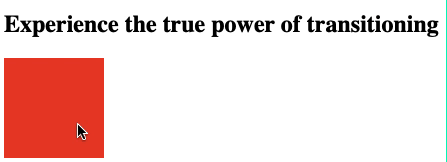
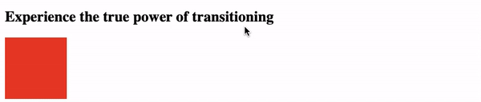

# Transition

[transition-delay](#-transition-delay)  
[transition-duration](#-transition-duration)  
[transition-property](#-transition-property)  

CSS Transitions allows you to change property values smoothly, over a given duration, animating the property changes, rather than having them occur immediately.

## //////////////////////////////////////////////////////////// transition-delay

Specifies when the transition effect will start. The _transition-delay_ value is defined in seconds (s) or milliseconds (ms).

## Property Values:

<ins>**time**</ins>

Specifies the number of seconds or milliseconds to wait before the transition effect will start. The delay may be zero, positive, or negative.

Following example shows the _div_ element which gets stretched after 2 seconds delay in case the user hovers over it.

## Example Files:

[transition.html, 1st part](html/transition.html)  

[To Top](#transition)

## //////////////////////////////////////////////////////////// transition-duration

Specifies how many seconds (s) or milliseconds (ms) a transition effect takes to complete.

## Property Values:

<ins>**time**</ins>

Specifies how many seconds or milliseconds a transition effect takes to complete. Default value is 0s, meaning there will be no effect.

This example demonstrates the transition effect which will last for 5 seconds after hovering over the element.

## Example Files:

[transition.html, 1st part](html/transition.html)  

[To Top](#transition)

## //////////////////////////////////////////////////////////// transition-property

Sets the CSS properties to which a transition effect should be applied.

This example performs a 4 second font size transition when the user hovers over the element, the _transition-property_ is the _font-size_.

## Property Values:

<ins>**none**</ins>

No property will get a transition effect.

<ins>**all**</ins>

Default value. All properties will get a transition effect.

<ins>**_all_**</ins>

# Example Files:

[transition.html, 1st part](html/transition.html)  

[To Top](#transition)

