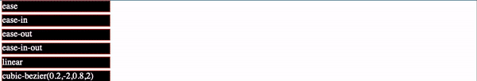

# Transition

[transition-delay](#-transition-delay)  
[transition-duration](#-transition-duration)  
[transition-property](#-transition-property)  
[transition-timing-function](#-transition-timing-function)  

CSS Transitions allows you to change property values smoothly, over a given duration, animating the property changes, rather than having them occur immediately.

## //////////////////////////////////////////////////////////// transition-delay

Specifies when the transition effect will start. The _transition-delay_ value is defined in seconds (s) or milliseconds (ms).

## Property Values:

<ins>**time**</ins>

Specifies the number of seconds or milliseconds to wait before the transition effect will start. The delay may be zero, positive, or negative.

Following example shows the _div_ element which gets stretched after 2 seconds delay in case the user hovers over it.

## Example Files:

[transition.html, 1st part](html/transition.html)  

[To Top](#transition)

## //////////////////////////////////////////////////////////// transition-duration

Specifies how many seconds (s) or milliseconds (ms) a transition effect takes to complete.

## Property Values:

<ins>**time**</ins>

Specifies how many seconds or milliseconds a transition effect takes to complete. Default value is 0s, meaning there will be no effect.

This example demonstrates the transition effect which will last for 5 seconds after hovering over the element.

## Example Files:

[transition.html, 1st part](html/transition.html)  

[To Top](#transition)

## //////////////////////////////////////////////////////////// transition-property

Sets the CSS properties to which a transition effect should be applied.

This example performs a 4 second font size transition when the user hovers over the element, the _transition-property_ is the _font-size_.

## Property Values:

<ins>**none**</ins>

No property will get a transition effect.

<ins>**all**</ins>

Default value. All properties will get a transition effect.

<ins>**_property_**</ins>

Defines a comma separated list of CSS property names the transition effect is for.

# Example Files:

[transition.html, 1st part](html/transition.html)  

[To Top](#transition)

## //////////////////////////////////////////////////////////// transition-timing-function

Specifies the speed curve of the transition effect. This property allows a transition effect to change speed over its duration.

Following figure demonstrates all the Cubic-Bèzier functions transition effect:

## Property Values: `<easing-functions>`

Each _<`easing-function`>_ represents the easing function to link to the corresponding property to transition (as defined in _transition-property_). The non-step keyword values (ease, linear, ease-in-out, etc.) each represent cubic Bèzier curve with fixed four point values, with the cubic-bezier() function value allowing for a non-predefined value.

<ins>**ease**</ins>

Default value. Specifies a transition effect with a slow start, then fast, then end slowly (equivalent to cubic-bezier(0.25, 0.1, 0.25, 1)).

<ins>**linear**</ins>

Specifies a transition effect with the same speed from start to end (equivalent to cubic-bezier(0, 0, 1, 1)).

<ins>**ease-in**</ins>

Specifies a transition effect with a slow start (equivalent to cubic-bezier(0.42, 0, 1, 1)).

<ins>**ease-out**</ins>

Specifies a transition effect with a slow end (equivalent to cubic-bezier(0, 0, 0.58, 1)).

<ins>**ease-in-out**</ins>

Specifies a transition effect with a slow start and end (equivalent to cubic-bezier(0.42, 0, 0.58, 1)).

<ins>**cubic-bezier(n, n, n, n)**</ins>

Defines your own values in the cubic-bezier function. Possible values are numeric values from 0 to 1.

`step()` function allows you to specify intervals for the timing function. I ttakes one or two parameters, separated by a comma: a positive integer and an optional value of either `start` or `end`. If no second parameter is included, it will default to `end`.

# Example Files:

**No Files**

[To Top](#transition)

