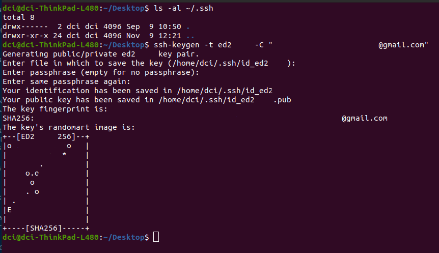

# Configuring Username and Email for GitHub (Linux)

 

Before setting your SSH-Keys, you first have to configure your global username and email address after installing Git.
 

> `$` git config --global user.name "_your-name_"  

> `$` git config --global user.email "_your-email_"

## Generating a new SSH key

1. Open terminal  

2. Paste the command text below, substituting in your GitHub email address.

> `$` ssh-keygen -t ed25519 -C "your_email@example.com"

This will result in:

1. After you've generated the public/private key pair, you will be asked to "Enter a file in which to save the key", so hit Enter.  
   It will choose the default location.

2. Then you will have to enter your secure passphrase 2-times.

## Adding your SSH key to the ssh-agent

1. Start the ssh-agent in the background

> `$` eval "\$(ssh-agent -s)"

> Output: Agent pid ----

2. Add your SSH private key to the ssh-agent. If you created your key with a different name, or if you are adding an existing key that has a different name, replace _id_rsa_ in the command with the nae of your private key file.

> `$` ssh-add ~/.ssh/id_ed-----

> Output:  
> Enter passphrase for /home/dci/.ssh/id_ed-----:  
> Bad passphrase, try again for /home/dci/.ssh/id_ed-----:
> Identity added: /home/dci/.ssh/id_ed----- (----------------@-----.com)

## Adding a new SSH key to your GitHub account

1. Copy the SSH key to your clipboard. First you have to check the `.ssh` directory for any `.pub` extensions:

> `$` ls -al ~/.ssh

> Output:  
> total 16
> drwx------ 2 dci dci 4096 Nov 10 10:28 .  
> drwxr-xr-x 25 dci dci 4096 Nov 10 10:35 ..  
> -rw------- 1 dci dci 484 Nov 10 10:28 id_ed25519  
> -rw-r--r-- 1 dci dci 115 Nov 10 10:28 id_ed25519.pub  

After that copy the contents of your `pub` file:

> `$` gedit ~/.ssh/id_ed25519.pub

- Now go to the _Settings_ in your GitHub account
- click on _SSH and GPG keys_
- paste the key
- click on _New SSH Key_
- if prompted, confirm your GitHub password

2. Checking with the GitHub host:

Simply type in your terminal:

> `$` ssh -T git@github.com

> Output:
>
> The authenticity of host 'github.com (140.82.121.4)' can't be established.  
> RSA key fingerprint is SHA256:--------------------------------.  
> Are you sure you want to continue connecting (yes/no/[fingerprint])? yes  
> Warning: Permanently added 'github.com,140.82.121.4' (RSA) to the list of known hosts.  
> Hi -------! You've successfully authenticated, but GitHub does not provide shell access.

# Generating a new SSH key for Mac

Repeat these steps:

1. Open terminal  

2. Paste the command text below, substituting in your GitHub email address.

> `$` ssh-keygen -t ed25519 -C "your_email@example.com"

This will result in:

1. After you've generated the public/private key pair, you will be asked to "Enter a file in which to save the key", so hit Enter.  
   It will choose the default location.

2. Then you will have to enter your secure passphrase 2-times.

## Adding your SSH key to the ssh-agent

1. Start the ssh-agent in the background 

> `$` eval `ssh-agent -s`

2. Being in `.ssh` folder (~/.ssh), add your private key using ssh-add: 

> `$` ssh-add id_ed25519

> Output:

Enter passphrase for id_ed25519:  
Identity added: id_ed25519 (------@mail.com)

3. Check if the key is added: 

> `$` ssh-add -l 

> Output:

256 SHA256:-----------PUB.-KEY--------------- -----EMAIL--------@mail.com (ED25519)

4. Read into id_ed25519 key, copy and add it to GitHub:

> `$` gedit id_ed25519.pub

5. Checking with the GitHub host:

> `$` ssh -T git@github.com

> Output: 

Warning: Permanently added the RSA host key for IP address '---.--.---.-' to the list of known hosts.  

Hi RafEissen! You've successfully authenticated, but GitHub does not provide shell access.  

Now hopefully you can use Git without extra passphrase prompts.